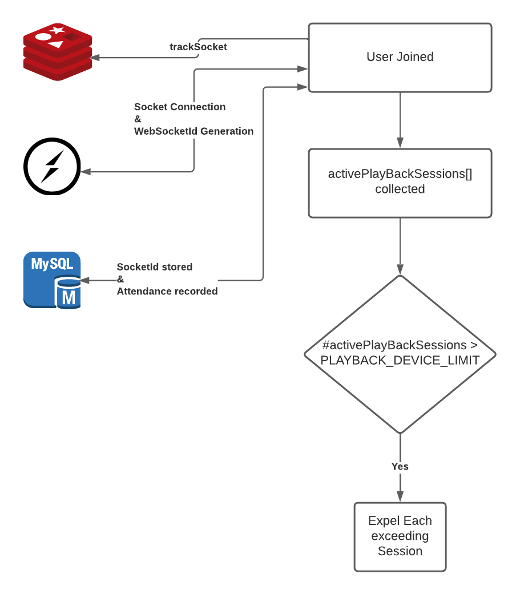

# Device limit

Limiting devices is crucial for several reasons:

1. Load on our servers: There is always some max limit on the number of users that our servers can support at any point of time. These values can be identified using load testing to know different parameters such as max WebSocket connections, api calls etc. Allowing everyone to view a stream simultaneously from different places can put extra load on our servers.

2. Cost: We are delivering a stream to users using CloudFront distribution. In order to secure the stream we are using Lambda@Edge functions. The lambda function is invoked for every new media playlist mentioned in the m3u8 playlist file. Number of lambda function invocations is directly proportional to the number of users who want to view the stream.

3. AWS quota limit and DOS prevention: There is always some API rate limit or quota restrictions from usage of the AWS services. Putting device limit measures helps us to not hit that limit in some way. It is directly related to the quality of service we are delivering to our end users.

4. Preventing misuse of user accounts: It might be possible that some users can share their credentials with their friends in order to watch streams for free. Preventing the same user from watching streams from multiple locations can help to reduce the misuse of their accounts.

## Implementation

We are using an attendance table and user active WebSocket connection information to limit the number of devices. We are storing attendance information of a breakout into the attendance table.

```
async limitPlayBackDevices(breakoutId, userId) {
    logger.trace('limitPlayBackDevices');
    const config = getConfigObj();
    const maxDevicesPerUserPerBreakout = config.get(Config.PLAYBACK_DEVICE_LIMIT) || 1;
    // Retrieve all Unexited Sessions from DB
    const playbackSessions =
      (await AttendanceModel.getActiveSessionsByBreakoutId(breakoutId, userId)) || [];
    const activePlaybackSessions = [];

    // Filter out sessions which have active websocket connection with server
    for (let session of playbackSessions) {
      const socketInfo = await redisService.getSocketInfo(session.active_socket_id);
      const { webSocketId } = socketInfo || {};
      if (webSocketId && isSocketConnected(webSocketId)) {
        activePlaybackSessions.push(session);
      }
    }

    // Limit Devices
    if (activePlaybackSessions.length > maxDevicesPerUserPerBreakout) {
      for (let i = 0; i < activePlaybackSessions.length - maxDevicesPerUserPerBreakout; i++) {
        // activePlaybackSessions.length-maxDevicesPerUserPerBreakout will not send socket message
        // to the most recently joined devices
        const session = activePlaybackSessions[i];
        await this.expelUser(breakoutId, session.active_socket_id);
      }
    }
}
```

Following config parameter control number of devices or locations allowed for a user to view a stream from. Default value of `PLAYBACK_DEVICE_LIMIT` is `1`. If you would like to override this value add this parameter to AWS parameter store as well to your local dot env file.

```
PLAYBACK_DEVICE_LIMIT=1
```

We keep track of each active socket in DB through attendance Table's `active_socket_id` column. This column stores the minified socket id that we generate, the actual Web Socket id (generated by SocketIO) is stored in redis. We can easily retrieve the actual socket id from the minified socket id:

```
const { webSocketId } = await redisService.getSocketInfo(socketId);
```

When a user joins a breakout, we pull all other un-exited attendances, check if their socket is active and collect them into `activePlaybackSessions`.If attendances in `activePlaybackSessions` exceeds `PLAYBACK_DEVICE_LIMIT`, we redirect user on older sessions to path '/'.

```
async expelUser(breakoutId, activeSocketId) {
    const socketId = activeSocketId || this.socketId;
    logger.trace(`expelUser breakoutId = ${breakoutId} socketId = ${socketId}`);
    const { webSocketId } = await redisService.getSocketInfo(socketId);
    if (webSocketId) {
      logger.trace('Sending playback command to: ', webSocketId);
      const socket = getClientSocket(webSocketId);
      socket.emit('playback', 'device-limit-exceeded');
      const roomName = getAudienceChatRoomName(breakoutId);
      socket.leave(roomName);
      await this.recordUserExit(socketId);
    }
}
```

On a browser side it listen for a `device-limit-exceeded` WebSocket message, it redirects the user to path '/'.

```
this.playbackCommandSubscription = this.socketService
      .onEvent<any>('playback')
      .subscribe({
        next: (data) => {
          if (data === 'device-limit-exceeded') {
            const title = 'Device Limit Exceeded';
            const message = 'You are viewing stream from new device. You\'ll be redirected shortly.';
            this.toasterService.showError(title, message);
            setTimeout(() => this.appCommonService.navigateTo('/'), 5000);
          }
        }
      });
```


