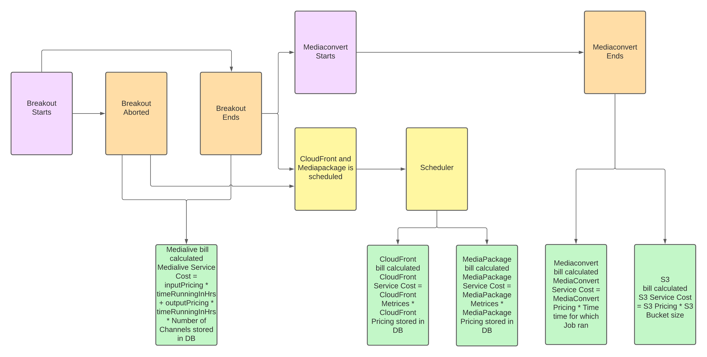

# Billing Approach



To find the final bill to be paid by the user we need to calulate the total cost of following services made by the user:

* MediaPackage
* CloudFront
* Medialive
* S3
* MediaConvert

***Total cost = MediaPackage cost + CloudFront cost + Medialive cost + S3 cost + MediaConvert cost***

While calculating the bill, we are making use of **metrics_bytes_downloaded** and **ingest_in_bytes** colums from breakouts table only for MediaPackage and CloudFront pricing because the billing of these services is dependent on metrices. Whereas services like Medialive, S3 and MediaConvert don't publish any metrices for calculating the bill.


## MediaPackage Pricing

For calculating the cost of MediaPackage service, we make use of **metrics_bytes_downloaded** column from breakouts table stored in the DB. Because MediaPackage billing is dependent on metrices used by the channel.

We store the values in **metrics_bytes_downloaded** column once the breakout is over, by calling AWS API to CloudWatch.

If we not store the values of AWS API call to CloudWatch in DB, then everytime we need to call the AWS API for calculating MediaPackage cost of MediaPackage service. And this is very time consuming.

```
    const egressInGB = PricingUtils.convertDataSize(egressInBytes, Sizes.Byte, Sizes.GB);
    const pricing = await Billing.getMediaPackageIngestPricing();
    const cost = pricing * egressInGB;
```

* MediaPackage service cost =  metrics_bytes_downloaded * (MediaPackage service price based on region)


## CloudFront Pricing

For calculating the cost of CloudFront service, we make use of **ingest_in_bytes** column from breakouts table stored in the DB. Because CloudFront billing is dependent on metrices used.

We store the values in **ingest_in_bytes** column once the breakout is over, by calling AWS API to CloudWatch.

If we not store the values of AWS API call to CloudWatch in DB, then everytime we need to call the AWS API for calculating cost of CloudFront service. And this is very time consuming.

```
    const cloudfrontDataDownloadPricing = await Billing.getCloudfrontDataDownloadPricing();
    const cost = cloudfrontDataDownloadPricing * PricingUtils.convertDataSize(bytesDownloaded, Sizes.Byte, Sizes.GB);
```

* CloudFront service cost =  ingest_in_bytes * (CloudFront service price based on region)

## Medialive Pricing

The cost of Medialive channel is dependent on the duration of Medialive channel ran.

```
    const timeRunningInHrs = Math.ceil(
      (breakout.session_end_time - breakout.session_start_time) / (1000 * 60 * 60) / 60,
    );
    const inputPricing = await Billing.getMedialiveInputPricing();
    const outputPricing = await Billing.getMedialiveOutputPricing();
    const outputs = [{}, {}, {}, {}];
    const charges =
      inputPricing * timeRunningInHrs + outputPricing * timeRunningInHrs * outputs.length;
    return charges;
```

* Medialive service cost =   (Input pricing based on region) * (Time running in hours) + (Onput pricing based on region) * (Time running in hours) * (Number of Medialive channels)

## S3 Pricing

The cost of S3 service is dependent on the size of S3 Bucket.

```
    let cost = 0;
    if (recording) {
      const recordingPath = await BreakoutModel.getRecordingFileSegmentPath(breakout.id);
      const bucket = process.env.S3_RECORDING_BUCKET;
      const sizeInByte = await S3.getFolderSize(bucket, recordingPath);
      const pricing = await Billing.getS3StoragePricing();
      cost = pricing * PricingUtils.convertDataSize(sizeInByte, Sizes.Byte, Sizes.GB);
    }
    return cost;
```

* S3 service cost =   (Bucket size) * (S3 storage pricing based on region)


## MediaConvert Pricing

The cost of MediaConvert service is dependent on the duration of job running.

```
    const job = await RecordingsModel.getByBreakoutId(breakout.id);
    const jobRunningInMs = new Date(job.update_timestamp) - new Date(job.create_timestamp);
    const pricing = await Billing.getMediaConvertPricing();
    const charges = pricing * (jobRunningInMs / (1000 * 60));
    return charges;
```

* MediaConvert service cost = (Job running in milliseconds) * (MediaConvert service based on region)