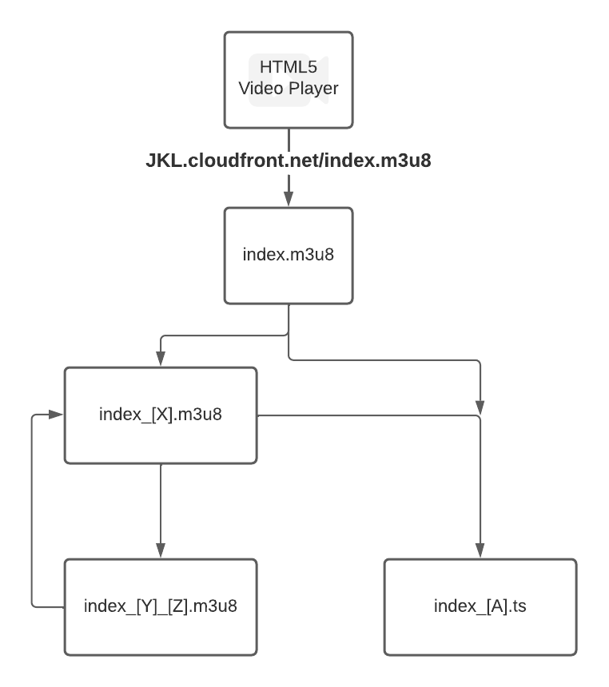
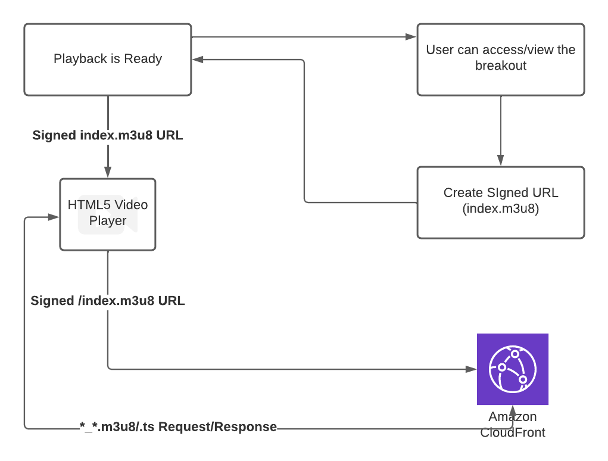
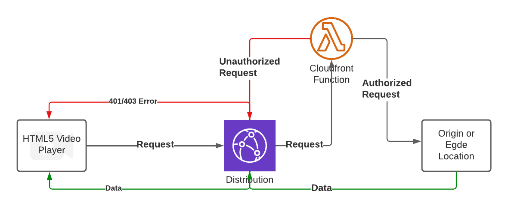

# Navigating a Playlist

When playing a Video from Cloudfront or MediaPackage Playback Endpoint, the extension is seen to be a `.m3u8` one. M3U8 refers to a playlist, i.e, when navigated to we get a response like

```
#EXTM3U
#EXT-X-VERSION:3
#EXT-X-INDEPENDENT-SEGMENTS
#EXT-X-STREAM-INF:BANDWIDTH=8969518,AVERAGE-BANDWIDTH=5711899,RESOLUTION=1920x1080,FRAME-RATE=30.000,CODECS="avc1.640032,mp4a.40.2"
index_1.m3u8
#EXT-X-STREAM-INF:BANDWIDTH=5449518,AVERAGE-BANDWIDTH=3511899,RESOLUTION=1280x720,FRAME-RATE=30.000,CODECS="avc1.64001F,mp4a.40.2"
index_2.m3u8
#EXT-X-STREAM-INF:BANDWIDTH=2754334,AVERAGE-BANDWIDTH=1792917,RESOLUTION=640x480,FRAME-RATE=30.000,CODECS="avc1.4D401E,mp4a.40.2"
index_3.m3u8
#EXT-X-STREAM-INF:BANDWIDTH=1434316,AVERAGE-BANDWIDTH=967899,RESOLUTION=320x240,FRAME-RATE=30.000,CODECS="avc1.4D400D,mp4a.40.2"
index_4.m3u8
```
The above response either contains further playlist Endpoints or Playback Endpoints (ending with `.ts`). When a `.ts` Endpoint is found, it indicates a Direct Playback Chunk, which is played by HTML5 Video Player. The logic kind of looks like:



## Point of Concern

Now that we have attached Distribution to Channel, the Endpoint URL of a Distribution is likely to remain intact no matter which Breakout is being streamed thorugh it. If a user **USER 1** has access to **Breakout X** streaming through **Channel A** he'll have the accompanying Distribution URL exposed to him/her, let's say it is **jkl.cloudfront.net**. When **Breakout Y** is streaming through the same **Channel A** (and ), and if **USER 1** doesn't have access to it, he/she can still get access to it because the Distribution URL was intact (**jkl.cloudfront.net**) if no Disaster Recovery happens (which is rare, unlikely and not at all desirable).

## Securing CloudFront Distributions

1. Using [Signed URLs](https://docs.aws.amazon.com/AmazonCloudFront/latest/DeveloperGuide/private-content-signed-urls.html)
From the above diagram, it is clear that no matter what happens, `/index.m3u8` is hit first, which relays to further navigation or playback. We can Sign each such URL and customize Cache Beahvior to achieve the desired Security. The flow would be:



The flaw in this case remains is that, anyone with the Signed URL can still access the Stream.

2. Using [CloudFront Functions](https://aws.amazon.com/blogs/aws/introducing-cloudfront-functions-run-your-code-at-the-edge-with-low-latency-at-any-scale/) (not [Lambda@Edge](https://aws.amazon.com/lambda/edge/), find differences [here](https://www.sentiatechblog.com/cloudfront-functions-and-lambda-edge-compared))

A CloudFront Function can be executed at the start of each request. The Function should be able to authorize the request, identify the user, check it's privilege to access the breakout and pass/block the request accordingly. We aim to use JWT here (which would contain privilege of user regarding the breakout and details of the user as well), and refrain from any kind of DB operation. The JWT must be formed at the time of start of playback (preferrably in PlaybackResolver).

Cloudfront Functions are nothing but stateless block of code that can be executed by AWS using it's Serverless Infrastructure. As seen below we can place 4 CloudFront Functions per distribution to customize or restrict the flow of data to and fro.


Out of these 4, we are only interested in the "Viewer Request" so that we can restirct the request before it even reaches origin, in case it is not authorized:

