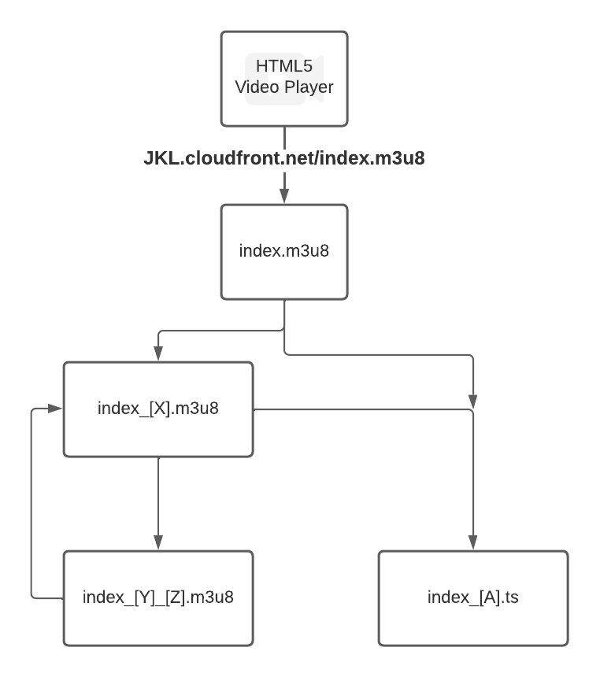

#  Distributions

Securing a live stream is crucial for protecting sensitive content, preventing unauthorized access, safeguarding intellectual property, mitigating piracy risks, maintaining brand reputation, complying with regulations, and ensuring a high-quality viewing experience. By implementing robust security measures, you can create a safe and trusted environment for broadcasting live content to your audience.

Securing a live stream is essential for several reasons:

1. Protection of Sensitive Content: Live streams often contain sensitive information, such as personal data, confidential discussions, or proprietary content. Securing the live stream ensures that this sensitive information remains confidential and is only accessible to authorized viewers.

2. Prevent Unauthorized Access: Without proper security measures, live streams can be vulnerable to unauthorized access or viewing. By implementing security protocols, such as authentication and encryption, you can ensure that only authorized viewers with valid credentials can access the live stream.

3. Intellectual Property Protection: Live streams may include valuable intellectual property, such as copyrighted material, trade secrets, or innovative ideas. Securing the live stream prevents unauthorized viewers from capturing or distributing this content, protecting your intellectual property rights.

4. Mitigate Content Piracy: Live streams are at risk of being pirated or illegally redistributed by unauthorized individuals. Implementing security measures, such as DRM (Digital Rights Management) or watermarking, can help deter piracy attempts and protect the exclusivity of your live stream content.

5. Maintain Brand Reputation: A compromised or unauthorized live stream can have a negative impact on your brand reputation. By securing the live stream, you demonstrate a commitment to data privacy and security, which enhances user trust and confidence in your brand.

6. Compliance with Regulations: Depending on the nature of the live stream content and the industry you operate in, there may be regulatory requirements related to data privacy and security that you need to adhere to. Implementing security measures helps you meet these compliance obligations.

7. Quality of Experience: Security measures can also contribute to a better viewing experience for your audience. By preventing unauthorized access or interruptions caused by malicious activities, you can ensure a smooth and uninterrupted live stream, enhancing viewer satisfaction.

## Configuring secure access and restricting access to content

CloudFront provides several options for securing content that it delivers. The following are some ways you can use CloudFront to secure and restrict access to content:

- Configure HTTPS connections
- Prevent users in specific geographic locations from accessing content
- Require users to access content using CloudFront signed URLs or signed cookies
- Set up field-level encryption for specific content fields
- Use AWS WAF to control access to your content

[Read more](https://docs.aws.amazon.com/AmazonCloudFront/latest/DeveloperGuide/SecurityAndPrivateContent.html).

In our case we are using CloudFront signed URLs to secure live broadcast stream and video on demand recording stream.

## Choosing between signed URLs and signed cookies

CloudFront signed URLs and signed cookies provide the same basic functionality: they allow you to control who can access your content. If you want to serve private content through CloudFront and you're trying to decide whether to use signed URLs or signed cookies, consider the following.

Use signed URLs in the following cases:
- You want to restrict access to individual files, for example, an installation download for your application.
- Your users are using a client (for example, a custom HTTP client) that doesn't support cookies.

Use signed cookies in the following cases:
- You want to provide access to multiple restricted files, for example, all of the files for a video in HLS format or all of the files in the subscribers' area of website.
- You don't want to change your current URLs.

If you are not currently using signed URLs, and if your (unsigned) URLs contain any of the following query string parameters, you cannot use either signed URLs or signed cookies:
- Expires
- Policy
- Signature
- Key-Pair-Id

CloudFront assumes that URLs that contain any of those query string parameters are signed URLs, and therefore won't look at signed cookies. [Read more](https://docs.aws.amazon.com/AmazonCloudFront/latest/DeveloperGuide/private-content-choosing-signed-urls-cookies.html).

## Secure Media Stream using CloudFront signed URLs

### Using CloudFront Trusted Key Group to protect media content

To create signed URLs, you need a signer. A signer is either a trusted key group (recommended) or a CloudFront key pair that you create in CloudFront, or an AWS account that contains a CloudFront key pair. Each signer that you use to create CloudFront signed URLs must have a public–private key pair. The signer, a Lambda function in this case, uses a private key to sign the URL, and CloudFront uses the public key to verify the signature.

We've following two shell scripts to create public-private keys and trusted key group.

**Create public key**

Refer following shell script file to create a public key.

```
scripts/deployment/create-cloudfront-public-key.sh
```

**Create Trusted Group**

Refer following shell script file to create a trusted key group.

```
scripts/deployment/create-cloudfront-key-group.sh
```

Our architecture to secure media stream is more like described in the following diagram. The difference is that we are using our API server instead of API gateway to send signed URL. Diagram below illustrates the flow that a user’s request goes through to playback your media files.




Let’s look at how user request flow as illustrated in diagram above works.

1. Client requests signed URL to *.m3u8 file by making API call to a protected resource. In our case, `breakout/:id?/distributions` API signs distribution endpoint URL. We replace `.m3u8` extension with `._m3u8` before returning URL to video player client. HLS video player will receive URL like: `https://yourcfdist.cloudfront.net/index._m3u8`

```
class DistributionV1View {
  constructor(channel, breakout, distributions) {
    ...
    for (const distribution of distributions) {
      distribution.endpoint_url = DistributionV1View.getSignedUrl(distribution.endpoint_url);
    }
  }
  static getSignedUrl(url) {
    // _m3u8 is a pseudo distribution behavior which in turns sends the request
    // to m3u8 behavior and signs each url in the response.
    // We need the pseudo behaviour to avoid an infinite request loop.
    const config = getConfigObj();
    const expiryInMs = parseInt(config.get(Config.CLOUDFRONT_SIGNATURE_EXPIRY_IN_SECS)) * 1000;
    return Cloudfront.getSignedURL(url.replace('.m3u8', '._m3u8'), expiryInMs);
  }
}
```

You can see that we've added Lambda@edge association for ._m3u8 path.

```
{
    PathPattern: '*._m3u8',
    TargetOriginId: targetOriginId,
    TrustedKeyGroups: {
        Enabled: true,
        Quantity: 1,
        Items: [configObj.get(Config.CLOUDFRONT_TRUSTER_KEY_GROUP_ID)],
    },
    LambdaFunctionAssociations: {
        Quantity: 1,
        Items: [
        {
            EventType: 'viewer-request',
            LambdaFunctionARN: configObj.get(
            Config.HLS_PROTECTION_CLOUDFRONT_LAMBDA_FUNCTION_ARN,
            ),
            IncludeBody: true,
        },
        ],
    },
    TrustedSigners: {
        Enabled: false,
        Quantity: 0,
    },
    ViewerProtocolPolicy: 'redirect-to-https',
    ResponseHeadersPolicyId: configObj.get(Config.CLOUDFRONT_RESPONSE_HEADERS_POLICY_ID),
    Compress: false,
    SmoothStreaming: false,
    ForwardedValues: {
        QueryString: false,
        Cookies: {
        Forward: 'none',
        },
        Headers: {
        Quantity: 0,
        Items: [],
        },
        QueryStringCacheKeys: {
        Quantity: 0,
        Items: [],
        },
    },
    MinTTL: 0,
    }
```

That means when client requests `https://yourcfdist.cloudfront.net/index._m3u8`, the lambda@edge function is invoked, in turn it download original m3u8 playlist file and sign each url contained in the file.

2. CloudFront behavior is matched based on path pattern `*._m3u8`. Associated lambda function is invoked.
3. Lambda gets CloudFront private key and caches for subsequent requests.
4. Lambda function downloads original m3u8 playlist file from the Mediapackage / S3.Using the private key, the URL to *.m3u8 file is signed and downloaded using `https.get(distSignedURL)`.
5. Lambda process entire m3u8 file with following logic.

```
for (const line of lines) {
    if (line.startsWith('#')) {
        body.push(line);
    } else if (line === '') {
        body.push(line);
    } else {
        if (line.endsWith(".m3u8")) {
        // Before Signing, replace .m3u8 with ._m3u8
        const signedURL = getSignedURL(urlPrefix + '/' + line.replace('.m3u8', '._m3u8'), expiryInMs);
        body.push(signedURL);
        } else {
        const signedURL = getSignedURL(urlPrefix + '/' + line, expiryInMs);
        body.push(signedURL);
        }
    }
}
```

If url ends with `.m3u8` extension then replace `.m3u8` extension with `._m3u8`, and sign URL. For other `.ts` files just sign those URL's.

6. Client requests *._m3u8 / *.ts file, passing custom query params Key-Pair-Id-PREFIX, Policy-PREFIX and Signature-PREFIX.
7. CloudFront behavior is matched and request is forwarded to the origin.
8. CloudFront makes origin request and passes custom headers.
9. Lambda function gets the original *.m3u8 manifest file from S3 / MediaPackage.
10. Lambda function modifies the .m3u8 manifest by appending signed URL params to each *.ts file name.
11. Client requests *.ts file, passing query params as part of request URL.
12. CloudFront behavior is matched and request is forwarded to the origin.
13. CloudFront makes origin request to MediaPackage / S3 and returns *.ts file.

### m3u8 playlist file format

When playing a Video from Cloudfront or MediaPackage Playback Endpoint, the extension is seen to be a `.m3u8` one. M3U8 refers to a playlist, i.e, when navigated to we get a response like:

```
#EXTM3U
#EXT-X-VERSION:3
#EXT-X-INDEPENDENT-SEGMENTS
#EXT-X-STREAM-INF:BANDWIDTH=8969518,AVERAGE-BANDWIDTH=5711899,RESOLUTION=1920x1080,FRAME-RATE=30.000,CODECS="avc1.640032,mp4a.40.2"
index_1.m3u8
#EXT-X-STREAM-INF:BANDWIDTH=5449518,AVERAGE-BANDWIDTH=3511899,RESOLUTION=1280x720,FRAME-RATE=30.000,CODECS="avc1.64001F,mp4a.40.2"
index_2.m3u8
#EXT-X-STREAM-INF:BANDWIDTH=2754334,AVERAGE-BANDWIDTH=1792917,RESOLUTION=640x480,FRAME-RATE=30.000,CODECS="avc1.4D401E,mp4a.40.2"
index_3.m3u8
#EXT-X-STREAM-INF:BANDWIDTH=1434316,AVERAGE-BANDWIDTH=967899,RESOLUTION=320x240,FRAME-RATE=30.000,CODECS="avc1.4D400D,mp4a.40.2"
index_4.m3u8
```
The above response either contains further playlist endpoints or playback endpoints (ending with `.ts`). when a `.ts` endpoint is found, it indicates a direct playback chunk, which is played by HTML5 video player.
