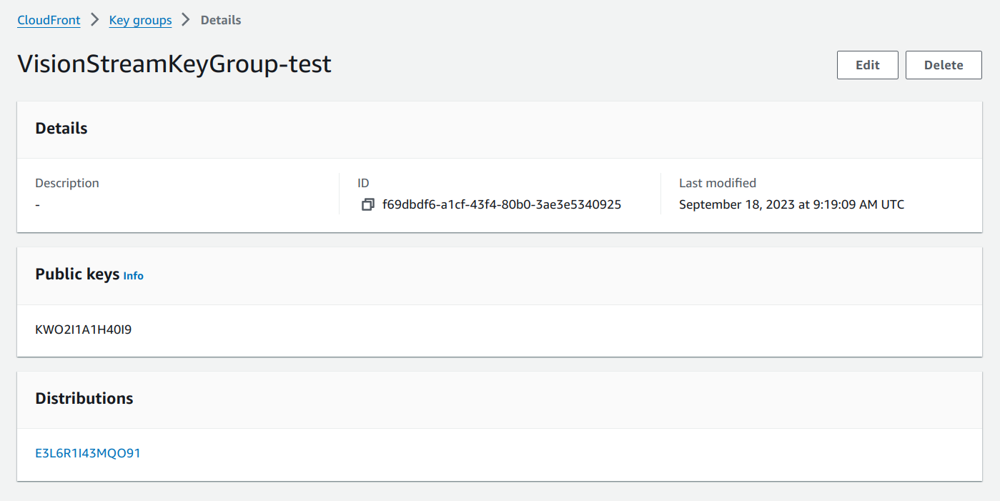
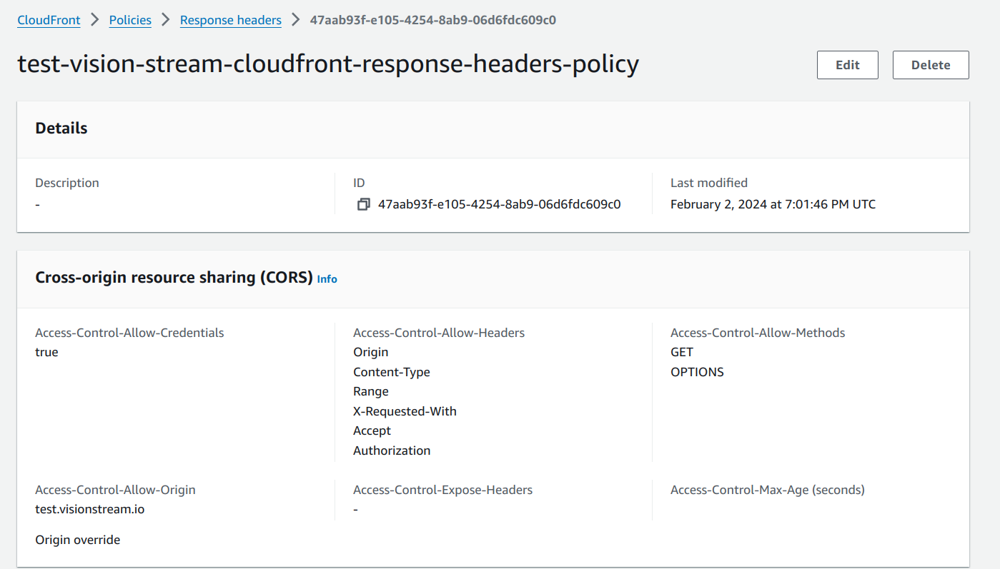
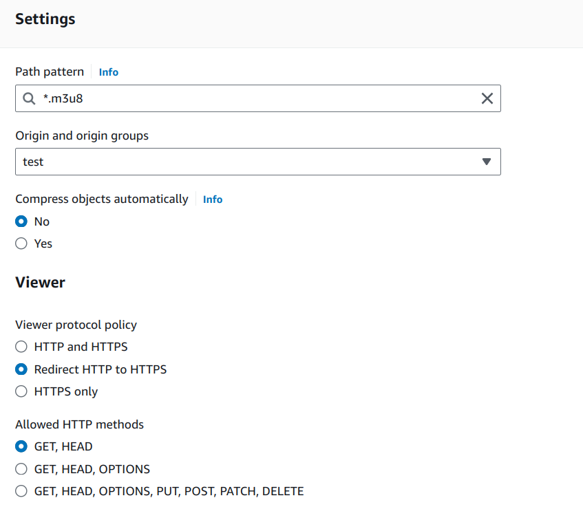
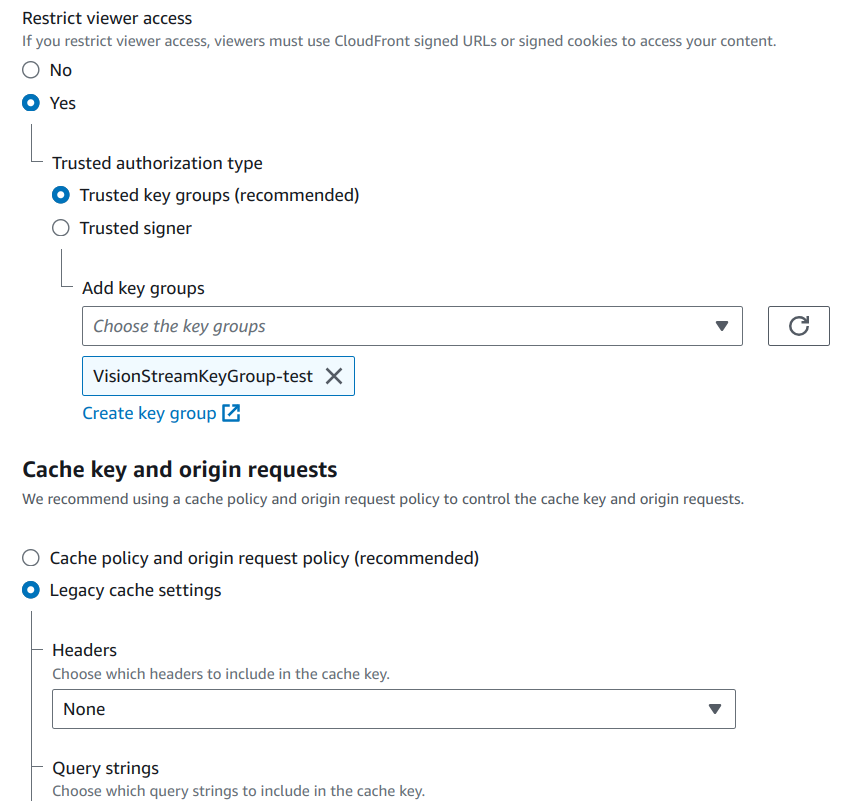
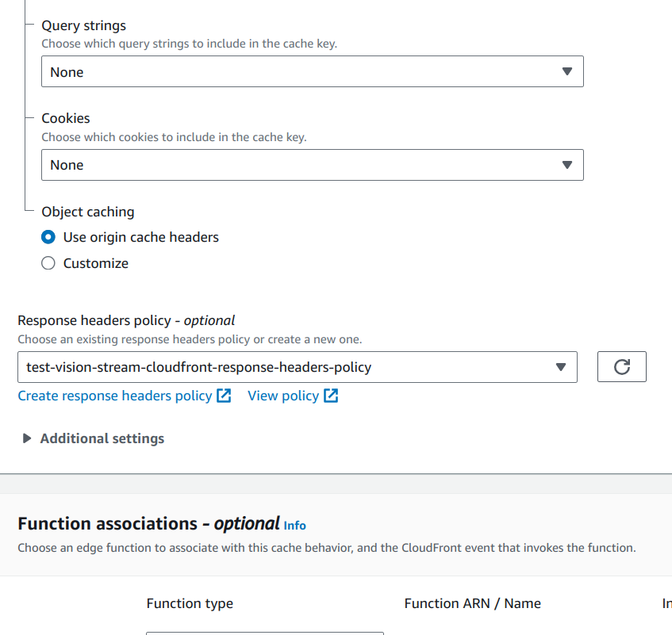
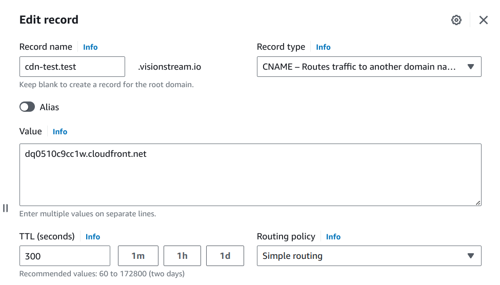

#  Distributions

## Challenges faced using Signed URLs

- Live streaming content delivery requires robust security measures to prevent unauthorized access to valuable media assets. While signed URLs have been a standard solution for securing access to these resources, certain limitations, particularly with iOS devices, prompted the need for an alternative approach.

- Ensuring that only authorized users can access the media is paramount when delivering live streaming content. Signed URLs have traditionally been used to achieve this, providing a secure way to grant temporary access to resources by appending a cryptographic signature to the URL. However, despite their effectiveness in many cases, signed URLs posed challenges when it came to certain iOS devices.

- Our initial implementation relied on signed URLs to secure access to live streaming content. While this approach worked seamlessly on most platforms, it encountered issues specifically with certain iOS devices. Users reported intermittent failures to access the content, leading to a frustrating user experience and potential loss of viewership.

- Upon investigation, it became evident that iOS devices, due to their strict handling of URL caching and expiration, were not consistently honoring the signed URLs, leading to authentication failures and inaccessible content. iOS doesn't support Media Source Extensions so hls.js can't be used on that platform. This inconsistency threatened the reliability and security of our live streaming service on iOS devices, necessitating a more robust solution.

- To address the limitations of signed URLs, we decided to transition to a signed cookies approach, leveraging the capabilities of AWS services to enhance security and reliability. 

## Signed Cookies Implementation

CloudFront provides several options for securing content that it delivers. The following are some ways you can use CloudFront to secure and restrict access to content:

- Setting Up Amazon CloudFront:

    - We utilized Amazon CloudFront as our content delivery network (CDN), which seamlessly integrates with AWS services for enhanced security and performance.
    
- Create CloudFront Keygroup:

    - Create public and private keys

        ```
        temp_dir=$(mktemp -d)
        mkdir $temp_dir/certs

        openssl genrsa -out $temp_dir/certs/private_key.pem 2048
        openssl rsa -pubout -in $temp_dir/certs/private_key.pem -out $temp_dir/certs/public_key.pem
        PUBLIC_KEY=$(cat $temp_dir/certs/public_key.pem)

        CALLER_REFERENCE=$(echo $RANDOM | md5sum | head -c 20)
        CF_PUBLIC_KEY_NAME="VisionStreamPublicKey-$ENV_TYPE"

        CF_PUBLIC_KEY_ID=$(aws cloudfront create-public-key \
            --region $REGION \
            --query 'PublicKey.Id' \
            --output text \
            --public-key-config CallerReference=$CALLER_REFERENCE,Name=$CF_PUBLIC_KEY_NAME,EncodedKey="$PUBLIC_KEY")

        echo "Created CF_PUBLIC_KEY_ID: $CF_PUBLIC_KEY_ID"
        ```
    - Attach public key to the key group.
    

- Create Response Headers Policy (for CORS).

    

- Update .m3u8 and .ts cache behavior

    

- Assign trusted key group:

    

- Assign response headers policy:

    - A trusted key group is used for authentication to verify the authenticity of requests, while response headers for CORS compliance are used to specify the domains that are allowed to access our content from different origins.

    - Together, these mechanisms help ensure secure and compliant cross-origin content delivery, protecting our resources from unauthorized access and maintaining the integrity of our content delivery system.

        

- Create Route 53 CNAME record

    - Third-party cookies are being deprecated.

    -  Many browsers do not support setting cookies on *.cloudfront.net. So we just assigned a custom subdomain to the CloudFront URL.

    - To do so, simply add a CNAME record of your subdomain pointing to your CloudFront URL.

        ```
        await route53.createCnameRecord(
        alternateDomain,
        result.Distribution.DomainName,
        config.get(Config.ROUTE53_HOSTED_ZONE_ID),
        );
        ```

        

- Generating Signed Cookies: 

    - Instead of appending signatures to URLs, we implemented a mechanism to generate signed cookies containing the necessary authentication information.

        ```
        * Get CloudFront signed cookies
        *
        * @param {*} url
        * @param {*} expiresInSeconds
        */
        function getCFSignedCookies(url, expiresInSeconds = 12 * 60 * 60) {
        const config = getConfigObj();
        const policy = JSON.stringify({
        Statement: [
            {
            Resource: url,
            Condition: {
                DateLessThan: {
                'AWS:EpochTime': Math.floor(new Date().getTime() / 1000) + expiresInSeconds,
                },
            },
            },
        ],
        });


        return getSignedCookies({
        policy,
        keyPairId: config.get(Config.CLOUDFRONT_PUBLIC_KEY_ID),
        privateKey: config.get(Config.CLOUDFRONT_SIGNER_PRIVATE_KEY).replace(/\\n/g, '\n'),
        });
        }
        ```

- What is a canned policy?

    - A canned policy is a predefined set of access conditions and settings provided by AWS for generating signed cookies or URLs. These policies are designed to cover common use cases and simplify the process of generating signed tokens.

    - Canned policies typically include parameters such as the expiration time, the allowed IP addresses or ranges, and other access constraints.

- What is a custom policy?

    - A custom policy is a user-defined set of access conditions and settings tailored to specific requirements. With a custom policy, users have full control over the access constraints and can define them according to their unique security and access control needs.

    - This includes specifying the exact expiration time, defining specific IP addresses or ranges allowed to access the resource, setting custom access controls based on user attributes or metadata, and incorporating additional security measures such as token encryption or HMAC (Hash-based Message Authentication Code) signing. 

    - Custom policies offer flexibility and granularity in access control but require users to specify each access condition explicitly.

- Why have we chosen a custom policy?

    - Canned policies provide predefined sets of access conditions for generating signed tokens, offering simplicity and convenience for common use cases, while custom policies offer flexibility and control for defining specific access constraints according to unique requirements.

- What are the cookies that we set?
    - We set these cookies:
        - CloudFront-Key-Pair-Id
        - CloudFront-Signature
        - CloudFront-Policy

- Which API is used to set cookies for live stream viewer vs recording viewer?

    - /public/:id?/stream-auth API endpoint is used to set cookies for live stream viewer.
    - /public/breakouts/:breakoutId/recordings API endpoint is used to set cookies for recording viewer.

- How are these cookies sent cross-origin?

    - When a browser makes a cross-origin request, it includes an Origin header indicating the origin of the requesting site. The server then responds with appropriate CORS headers, which can include the Access-Control-Allow-Origin header. This header specifies which origins are allowed to access the requested resource. If the server allows the requesting origin, the browser proceeds with the request and includes any relevant cookies associated with the requested domain.

    - In addition to Access-Control-Allow-Origin, other CORS headers like Access-Control-Allow-Credentials and Access-Control-Allow-Headers are used to specify whether credentials (such as cookies) should be included in the request and which additional headers are allowed to be sent.

    - CNAME records are used to alias one domain name to another. For example, if a website serves content from a subdomain hosted by a third-party service, a CNAME record might be set up to map the subdomain to the third party's domain. This can impact cross-origin requests if cookies are scoped to a specific domain, as the browser may include cookies associated with the CNAME-recorded domain when making requests to the target domain.

- Which attribute do we set on the video element to let cross-origin cookies flow to distribution?

    - We set the crossorigin="use-credentials" attribute on the video element to let cross-origin cookies.
    - By setting the crossorigin="use-credentials" attribute on the video element, the browser ensures that any cookies associated with the video's origin are sent along with the request, allowing the server hosting the video to recognize and authenticate the user, if necessary.

- How do we clear these cookies from the browser? Which APIs are used?

    - When the ViewLiveStreamComponent and VideoPlayerComponent are destroyed we call the  `api/breakout/signout-stream` API endpoint to clear these cookies from the browser. 
    
    - To clear cookies, we remove them by setting their expiration time to a past date. This effectively instructs the browser to delete the cookie. 
    
    - In the provided function signoutStream(res), it clears the cookies by setting their expiration time to a past date.

        ```
        function signoutStream(res) {
            const configObj = getConfigObj();
            const cookies = ['CloudFront-Key-Pair-Id', 'CloudFront-Policy', 'CloudFront-Signature'];
            const url = new URL('http://' + configObj.get(Config.RECORDING_CLOUDFRONT_DIST_DOMAIN));
            const cookieDomain = url.host.substring(url.host.indexOf('.'));
            for (const cookie of cookies) {
                    res.cookie(cookie, '', {
                        path: '/',
                        domain: cookieDomain,
                        expires: new Date(null),
                        secure: true,
                        httpOnly: true,
                        sameSite: 'none',
                    });
                }
        }
        ```

--------------------

By transitioning from signed URLs to signed cookies, we were able to overcome the limitations encountered with certain iOS devices while enhancing the overall security and reliability of our live streaming service. Leveraging AWS services such as CloudFront, IAM, Lambda@Edge, and monitoring tools, we implemented a robust solution that ensures only authorized users can access our content, regardless of the platform or device they're using. This not only enhances the user experience but also safeguards valuable media assets against unauthorized access and potential security breaches.
