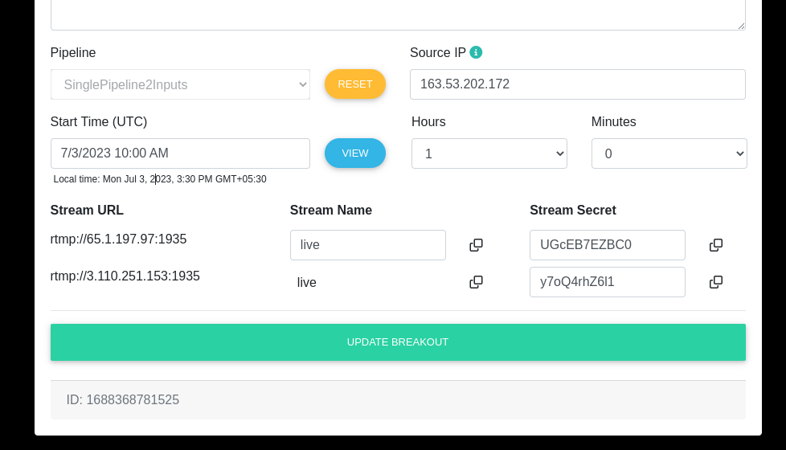
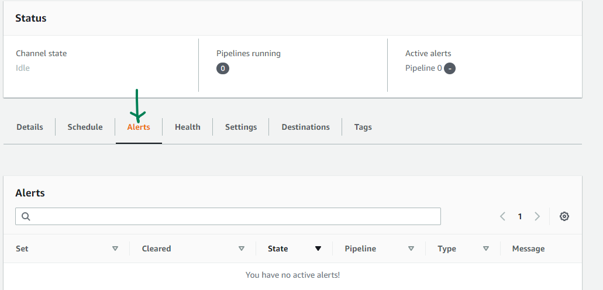

# Single Pipeline Failover

You can implement automatic input failover in a single-pipeline channel to protect the channel from failure in the upstream system or the network connection that is upstream of MediaLive.

You can implement automatic input failover in push inputs, but not in pull inputs.

Keep in mind that the channel can't have more than two push inputs. This means that you can implement one of these scenarios:
- You can set up two push inputs in the channel, but you won't be able to implement automatic input failover for either of these inputs.
- You can set up one push input in the channel, and you can implement automatic input failover for that input.

## Single pipeline channel inputs
If you set up the channel as a single-pipeline channel, only the first endpoint will be used. MediaLive won't expect to receive content at the second endpoint.

You can see in the following screenshot that there are total 4 endpoint URLs. First two belongs to input 1 while other two are of input 2. Notice green checkmark next to the url on which you can stream while red crossmark where you likely to get connection time out errors.

## Setup

To implement automatic input failover for the selected push input, you create two standard-class inputs, in the usual way. When you create the channel, you attach these two inputs and then set them up as a failover pair.

When you start the channel, the channel ingests the content from both inputs. But only one input (for example, the blue input in the diagram below) enters the channel pipeline for processing. The other input (the yellow input) is ingested but discarded immediately. The pipeline produces one output for the downstream system, in the usual way.

As this diagram illustrates, there are two instances of the content source.

## Failure handling

If there is a failure, the behavior is as follows:
- If there is a failure upstream of the first input, then automatic input failover occurs. The channel immediately fails over to the yellow pipeline in the second input, which is already being ingested. The channel fails over and starts processing that input. There is no disruption in the channel pipeline or in the output.
- If there is a failure in the channel pipeline (for example, in pipeline 0), MediaLive stops producing output. Switching the input would not help this failure because the problem is in the pipeline, not in the input.

This diagram illustrates the flow after there is a failure upstream of the first input. MediaLive has failed over to the second input.

## How to test Failover?
1. Open two instances of OBS.
2. Stat streaming on the first and third streaming URL's shown in the above screenshot. (Use first endpoint of input)
3. Go to the AWS Medialive console and click on the channel through which you are streaming. Click Alerts tab.
4. Once you able to view stream, stop streaming from input 1.
5. Wait for few seconds / minutes, you'll see logs of stream is not receiving in alerts tab.
6. After some time, may be few seconds it'll show that it has been Failover to input 2.
7. Verify stream in the player, it should play video from input 2.

## References:
- https://docs.aws.amazon.com/medialive/latest/ug/aif-single-pipeline-how.html
