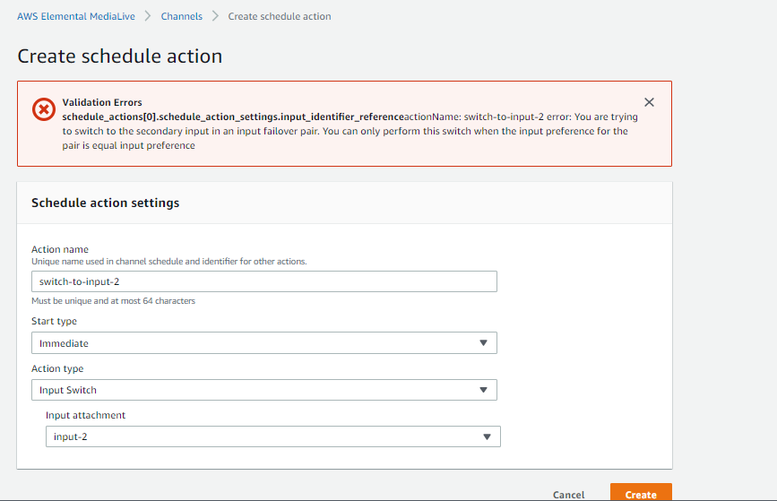

#  Forcing a Failover

You can set up automatic input failover for manual failover.

Keep in mind that the content in the failover pair is identical. Therefore, you only switch between them for specific reasons. For example:
- You might think that the active input is degrading, but MediaLive hasn't yet made the decision to fail over to the other input.
- You might want to perform maintenance on the network for the input that is currently active.

To switch between the two inputs in the input pair
1. If you think you might want to manually switch inputs, then when you set up the failover pair, set the Input preference to EQUAL_INPUT_PREFERENCE. See Setting up automatic input failover with RTMP and RTP inputs or Setting up automatic input failover with MediaConnect inputs.
2. To manually switch, create an input switch action in the schedule in the usual way. Set up the input to switch to the other input, and set the Start Type to Immediate.

We cannot do manual failover with PRIMARY_INPUT_PREFERRED. You'll get following error:
- Error: `You are trying to switch to the secondary input in an input failover pair. You can only perform this switch when the input preference for the pair is equal input preference`

## References:
- <a href="https://docs.aws.amazon.com/medialive/latest/ug/aif-and-input-switching-failoverpair.html" target="_blank">Manually forcing a failover</a>
