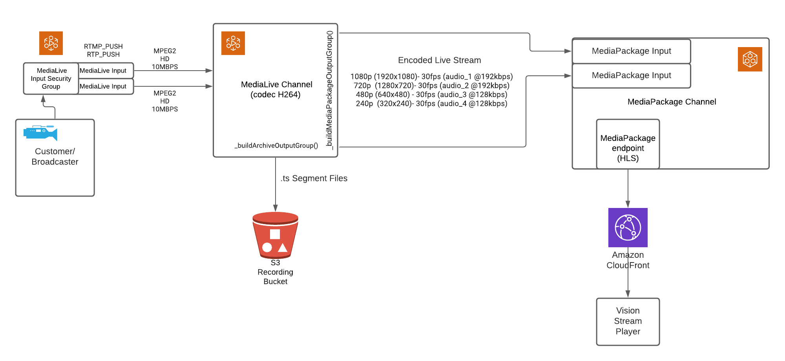

# Elemental MediaLive

## Overview
MediaLive channels use the following AWS media services for streaming events. Do not confuse it with AWS Elemental MediaLive. We call it MediaLive because we think this service does the heavy lifting task of encoding streams.

### 1. AWS Elemental MediaLive
Encode live video for broadcast and streaming to any device. AWS Elemental MediaLive is a broadcast-grade live video processing service.

<a href="https://aws.amazon.com/medialive/" target="_blank">Read More...</a>

### 2. AWS Elemental MediaPackage
Easily prepare and protect video for delivery to Internet devices. AWS Elemental MediaPackage reliably prepares and protects your video for delivery over the Internet. From a single video input, AWS Elemental MediaPackage creates video streams formatted to play on connected TVs, mobile phones, computers, tablets, and game consoles.

<a href="https://aws.amazon.com/mediapackage/" target="_blank">Read More...</a>

### 3. AWS CloudFront
Amazon CloudFront speeds up distribution of your static and dynamic web content, such as .html, .css, .php, image, and media files. When users request your content, CloudFront delivers it through a worldwide network of edge locations that provide low latency and high performance.

<a href="https://aws.amazon.com/cloudfront/" target="_blank">Read More...</a>

### 4. AWS Elemental MediaConvert
Process video files and clips to prepare on-demand content for distribution or archiving.

<a href="https://aws.amazon.com/mediaconvert/" target="_blank">Read More...</a>

## MediaLive channel pipeline


Diagram: VisionStream configuration



## Create channel pipeline steps

**AWS Elemental Mediapackage configuration**
* [Create MediaPackage Channel](#create-mediapackage-channel)
* [Create MediaPackage endpoint](#create-mediapackage-endpoint)

**AWS Elemental MediaLive configuration**
* [Create MediaLive Input Security Group](#create-medialive-input-security-group)
* [Create MediaLive Input](#create-medialive-input)
* [Create MediaLive Channel](#create-medialive-channel)

### Create MediaPackage Channel

MediaPackage Channels expects an Encoder to send it "Live Content Stream". It then packages the stream and outputs to an `MediaPackage Endpoint` which is consumed "Downstream Devices/Services". In our case, the "Downstream Service" is Cloudfront.

When a MediaPackage channel is created, exactly 2 Input(s) are created automatically. These inputs are intact throughout the lifecycle of the Channel. These Inputs consume the "Live Content Stream" from an Encoder (in our case, MediaLive Channels).

From the <a href="https://docs.aws.amazon.com/mediapackage/latest/ug/supported-inputs-live.html" target="_blank">Official Docs regarding "Live supported codecs and input types"</a>, we are using `hls` (which is supported) as the input type for our MediaPackage Inputs.

```
    const params = {
      Id: internalName + '-package',
      Tags: tags,
      Description: description,
    };

    mediapackage.createChannel(params, function (err, data) {
      if (err) { reject(err); return; }
      resolve(data);
    });
```

Please note that, while creating a MediaPackage Channel we are not specifying the Input Types, so it is safe to say that MediaPackage Channel Inputs have `hls` type by default.

###  Create MediaPackage Endpoint

A <a href="https://docs.aws.amazon.com/mediapackage/latest/ug/endpoints.html" target="_blank">MediaPackage Endpoint</a> is integrated into a MediaPackage Channel, which is nothing but the **Streaming URL** and eventually Wrapped by CloudFront.

```
    const packages = {
      HlsPackage: {
        IncludeIframeOnlyStream: false,
        PlaylistType: 'NONE',
        PlaylistWindowSeconds: 60,
        ProgramDateTimeIntervalSeconds: 0,
        SegmentDurationSeconds: 6,
        UseAudioRenditionGroup: false,
        AdMarkers: 'PASSTHROUGH',
      },
      DashPackage: {
        ManifestWindowSeconds: 60,
        MinBufferTimeSeconds: 30,
        MinUpdatePeriodSeconds: 15,
        Profile: 'NONE',
        SegmentDurationSeconds: 2,
        SuggestedPresentationDelaySeconds: 25,
      },
      MssPackage: {
        ManifestWindowSeconds: 60,
        SegmentDurationSeconds: 2,
      },
      // feature/P20903447 adding CMAF as an endpoint.
      CmafPackage: {
        SegmentDurationSeconds: 6,
        HlsManifests: [
          {
            Id: 'pro-stream-demo-package' + '-cmaf-hls',
            AdMarkers: 'PASSTHROUGH',
            IncludeIframeOnlyStream: false,
            PlaylistType: 'NONE',
            PlaylistWindowSeconds: 60,
            ProgramDateTimeIntervalSeconds: 0,
          },
        ],
      },
    };
    const params = {
      ChannelId: chanId,
      Tags: tags,
      Description: description,
      ManifestName: 'index',
      StartoverWindowSeconds: 0,
      TimeDelaySeconds: 5,
      Id: chanId + '-hls',
      HlsPackage: packages.HlsPackage,
    };
    mediapackage.createOriginEndpoint(params, function (err, data) {
      if (err) {
        logger.error('Error occurred while creating origin endpoint.', err);
        reject(err);
        return;
      }
      resolve(data);
    });
```

Looking at the `params` from the above code, it is inferred that only `HlsPackage` property is used from `packages` object. Hence properties like `CmafPackage`, `DashPackage`, `MssPackage` can be removed. Also, looking at the `Input Type` of Channel (which is `hls`), it is intuitive to say that only `HlsPackage` would be required.

Before understanding any further, we need to understand some terminologies & concepts:

* **Manifests** - Containers for Live or OnDemand Streaming. The downstream devices are sent a "Manifest" which contains meta-data about the Streaming Session.

* **SCTE-35 Markers** - Contained in the Live Stream, and are responsible for inserting Dynamic Ads into a Live Stream.

Apart from the <a href="https://docs.aws.amazon.com/AWSJavaScriptSDK/latest/AWS/MediaPackage.html#createOriginEndpoint-property" target="_blank">Official AWS Docs, let us look into what the properties of `package.HlsPackage` actually are:
1. IncludeIframeOnlyStream: false
    - When Set, enabled "Forward" & "Rewind" capabilities to the incoming stream in Downstream Player Applications
2. PlaylistType: 'NONE'
    - When 'EVENT' or 'VOD' Allows the Stream to be included in a Playlist of the same manifest
    - When 'EVENT', it is added only when available
    - When 'VOD', it indicates that this is not a Live Stream and all media content is readily available
3. PlaylistWindowSeconds: 60
    - Since `PlaylistType` is `NONE`, this is rendered useless.
4. ProgramDateTimeIntervalSeconds: 0
    - Set to a value > 0 if we want to set the value of `AdMarkers` property to "DATERANGE".
5. SegmentDurationSeconds: 6
    - AWS Elemental MediaPackage rounds segments to the nearest multiple of the input segment duration
6. UseAudioRenditionGroup: false
    - A rendition group packages all subtitle or audio tracks and injects them in all video renditions in the stream.
    - Useful when multiple languages or multiple audio codecs are used in Encoding.
7. AdMarkers: 'PASSTHROUGH'
    - The SCTE-35 Messages are copied and packaged to Endpoint without any processing.

### Create MediaLive Input Security Group
An input security group protects the Encoder by allowing only whitelisted IP to shoot Incoming Traffic (the Live Stream). A list of Purposes can be found <a href="https://docs.aws.amazon.com/medialive/latest/ug/purpose-input-security-groups.html" target="_blank">in Official AWS Docs</a>.

From our codebase, we call `createInputSecurityGroup` of `MediaLive API` to create an Input Security Group:

```
    const params = {
        Tags: tags,
        WhitelistRules: [ { Cidr: whiteCidrIp + '/0' } ],
    };
    medialive.createInputSecurityGroup(params);
```


### Create MediaLive Input

Now since we have the Input Security Group, we create <a href="https://docs.aws.amazon.com/medialive/latest/ug/inputs.html" target="_blank">MediaLive Input</a>, which are eventually consumed by `MediaLive Channels`.

From our codebase, we call `createInputSecurityGroup` of `MediaLive API` to create an Input:

```
    const params = {
        Destinations: [ { StreamName: name + '-destination' } ],
        InputSecurityGroups: [securityId],
        Name: name + '-input',
        RoleArn: process.env.AWS_MEDIA_LIVE_ACCESS_ROLE,
        Type: inputType,
        Tags: tags,
    };

    if (inputType === MEDIALIVE_INPUT_TYPE.RTMP_PUSH) {
        params.Destinations = [ { StreamName: 'live/input1' }, { StreamName: 'live/input2'} ];
    }

    medialive.createInput(params);
```

The properties to understand in the `params` are: 

* InputSecurityGroups - To filter allowance of Incoming Traffic only by a set of rules.
* Type: "RTMP_PUSH" - the consumers open a connection to the server and keep it constantly active. The producer will send (push) all new events to the consumers using that single always-on connection. In other words, the producer PUSHes the new events to the consumers.
* Destinations - Since, we have the Type as "RTMP_PUSH", two destinations are provided which escalates the Input Class to "STANDARD_INPUT" (instead of "SINGLE_INPUT"). This enables the Producer to replicate the Live Stream Content by attaching the source to both of the Inputs, which is the first step towards Resiliency. In our case, however we are using only `live/input1` Input.

### Create MediaLive Channel

While the source stream is being encoded, we derive two outputs:
* Encoded stream sent downstream to MediaPackage Inputs (Configured in `_buildMediaPackageOutputGroup()`)
* Segment Files (.ts) stored in S3 (Configured in `_buildArchiveOutputGroup()`)

The code below is for Archiving the live stream to .ts files:

```
    function _buildArchiveOutputGroup(rolloverInterval) {
        logger.trace('_buildArchiveOutputGroup');
        return {
            OutputGroupSettings: {
                ArchiveGroupSettings: {
                    Destination: {
                        DestinationRefId: ARCHIVE_OUTPUT_GROUP_DEST_ID,
                    },
                    RolloverInterval: rolloverInterval || 300,
                },
            },
            Name: ARCHIVE_OUTPUT_GROUP_NAME,
            Outputs: [
                {
                    OutputSettings: {
                        ArchiveOutputSettings: {
                            NameModifier: '-file-segment',
                            ContainerSettings: {
                                M2tsSettings: {
                                    CcDescriptor: 'DISABLED',
                                    Ebif: 'NONE',
                                    NielsenId3Behavior: 'NO_PASSTHROUGH',
                                    ProgramNum: 1,
                                    PatInterval: 100,
                                    PmtInterval: 100,
                                    PcrControl: 'PCR_EVERY_PES_PACKET',
                                    PcrPeriod: 40,
                                    TimedMetadataBehavior: 'NO_PASSTHROUGH',
                                    BufferModel: 'MULTIPLEX',
                                    RateMode: 'CBR',
                                    AudioBufferModel: 'ATSC',
                                    AudioStreamType: 'DVB',
                                    AudioFramesPerPes: 2,
                                    SegmentationStyle: 'MAINTAIN_CADENCE',
                                    SegmentationMarkers: 'NONE',
                                    EbpPlacement: 'VIDEO_AND_AUDIO_PIDS',
                                    EbpAudioInterval: 'VIDEO_INTERVAL',
                                    EsRateInPes: 'EXCLUDE',
                                    Arib: 'DISABLED',
                                    AribCaptionsPidControl: 'AUTO',
                                    AbsentInputAudioBehavior: 'ENCODE_SILENCE',
                                    PmtPid: '480',
                                    VideoPid: '481',
                                    AudioPids: '482-498',
                                    DvbTeletextPid: '499',
                                    DvbSubPids: '460-479',
                                    Scte27Pids: '450-459',
                                    Scte35Pid: '500',
                                    Scte35Control: 'NONE',
                                    Klv: 'NONE',
                                    KlvDataPids: '501',
                                    TimedMetadataPid: '502',
                                    EtvPlatformPid: '504',
                                    EtvSignalPid: '505',
                                    AribCaptionsPid: '507',
                                },
                            },
                        },
                    },
                    VideoDescriptionName: 'video_y9kk1h',
                    AudioDescriptionNames: ['audio_bcewbv'],
                    CaptionDescriptionNames: [],
                },
            ],
        };
    }
```

Before walking through the settings, let us be familiar with some terminologies:

* Transport Stream - MPEG transport stream (MPEG-TS, MTS) or simply transport stream (TS) is a standard digital container format for transmission and storage of audio, video.
* Programs & PMT - Transport stream has a concept of programs. Every program is described by a Program Map Table (PMT). The elementary streams associated with that program have PIDs listed in the PMT. Another PID is associated with the PMT itself. For instance, a transport stream used in digital television might contain three programs, to represent three television channels. Suppose each channel consists of one video stream, one or two audio streams, and any necessary metadata. A receiver wishing to decode one of the three channels merely has to decode the payloads of each PID associated with its program.
* Caption Service Descriptors - Caption Service Descriptors are used to aid in the navigation of digital closed caption services and are carried in the PMT.
* EBIF - Enhanced TV Binary Interchange Format is a multimedia content format. The primary purpose of the EBIF content format is to represent an optimized collection of widget and byte code specifications that define one or more multimedia pages, similar to web pages, but specialized for use within an enhanced television or interactive television system.
* Nielsen Inaudible Tones - Non-Intrusive content within the Live Stream, serving almost as "metadata" that allows upstream Producer to track the number of Consumer downstream. Every encoder has an "ID3 Tag Inserter". When an encoder detects such tones, it inserts ID3 tags, which are eventually tracked when consumed downstream.

As the name suggest, `ArchieveOutputGroup` is basically the configuration which the Encoder uses to spit the `.ts` Segment Files into S3 while encoding the live stream. Ignoring the hierarchy, let's understand the properties:

* RolloverInterval - Number of seconds of "encoded" Live Stream Content stored in each Segment file.
* M2tsSettings - From <a href="https://docs.aws.amazon.com/medialive/latest/ug/creating-archive-output-group.html" target="_blank">Creating an archive output group</a>, it is evident that the default extension for archive files are **.m2ts**. <a href="https://docs.aws.amazon.com/medialive/latest/ug/archive-examples.html" target="_blank">See Examples. Hence, the `M2tsSettings`. Looking closely, "m" suggests "MPEG" (Input) and "t2" suggests the ".ts" segment files (output).
* CcDescriptor: 'DISABLED' - When 'ENABLED', generates captionServiceDescriptor in PMT. This is how we can have captions in the Player.
* Ebif: 'NONE' - When 'PASSTHROUGH', allows EBIF Data from Input Source to pass down to Output.
* NielsenId3Behavior: 'NO_PASSTHROUGH' - When 'PASSTHROUGH', it permits the Encoder to insert ID3 Tags in the output whenever a Nielsen Inaudible Tone is detected in the Input.
* ProgramNum: 0 - A Live Content Stream being a Program in the PMT, ProgramNum indicates Index/Order/Position of a Stream.


the below code is for Encoding the live stream and send the result(output) to MediaPackage Inputs:

```
    function _buildMediaPackageOutputGroup() {
        logger.trace('_buildMediaPackageOutputGroup');
        return {
            OutputGroupSettings: {
                MediaPackageGroupSettings: {
                    Destination: {
                        DestinationRefId: MEDIAPACKAGE_OUTPUT_GROUP_DEST_ID,
                    },
                },
            },
            Name: 'HD',
            Outputs: [
                {
                    OutputSettings: {
                        MediaPackageOutputSettings: {},
                    },
                    OutputName: '1080p30',
                    VideoDescriptionName: 'video_1080p30',
                    AudioDescriptionNames: ['audio_1'],
                    CaptionDescriptionNames: [],
                },
                {
                    OutputSettings: {
                    MediaPackageOutputSettings: {},
                    },
                    OutputName: '720p30',
                    VideoDescriptionName: 'video_720p30',
                    AudioDescriptionNames: ['audio_2'],
                    CaptionDescriptionNames: [],
                },
                {
                    OutputSettings: {
                    MediaPackageOutputSettings: {},
                    },
                    OutputName: '480p30',
                    VideoDescriptionName: 'video_480p30',
                    AudioDescriptionNames: ['audio_3'],
                    CaptionDescriptionNames: [],
                },
                {
                    OutputSettings: {
                    MediaPackageOutputSettings: {},
                    },
                    OutputName: '240p30',
                    VideoDescriptionName: 'video_240p30',
                    AudioDescriptionNames: ['audio_4'],
                    CaptionDescriptionNames: [],
                },
            ],
        };
    } 
```
The above configyration let's `MediaLive` Channels encode the Live Stream into **4 variants**:
1. **1080p** - **30bps** with audio channel `audio_1`
2. **720p** - **30bps** with audio channel `audio_2`
3. **480p** - **30fps** with audio channel `audio_3`
4. **240p** - **30fps**  with audio channel `audio_4`

Audio channels `audio_X` is defined in paramters of `createChannel` in the next few code blocks.

MediaLive searches for a "Destination", matching an Output group. We have specified two Output Groups, hence we need to specify two Destinations as well. We already know what those two are going to be:
* MediaPackage (Channel Input)
* S3 (Bucket)

```
    function _buildChannelDestinations(mediaPackageChannelId, s3Bucket) {
        const destinations = [
            {
                Id: MEDIAPACKAGE_OUTPUT_GROUP_DEST_ID,
                Settings: [],
                MediaPackageSettings: [ { ChannelId: mediaPackageChannelId } ],
            },
        ];
        if (s3Bucket) {
            const s3Url = `s3ssl://${s3Bucket}/default`;
            destinations.push({
                Id: ARCHIVE_OUTPUT_GROUP_DEST_ID,
                Settings: [ { Url: s3Url } ],
                MediaPackageSettings: [],
            });
        }
        return destinations;
    }
```

Now that we have all the requisites met, we can peek into  `createChannel` parameters which eventually configures the whole MediaLive Channel:

```
    const s3Bucket = process.env.S3_RECORDING_BUCKET;
    const outputGroups = [];
    outputGroups.push(_buildArchiveOutputGroup());
    outputGroups.push(_buildMediaPackageOutputGroup());
    const destinations = _buildChannelDestinations(chanId, s3Bucket);
    const params = {
        Destinations: destinations,
        InputSpecification: {
            Codec: 'MPEG2',
            Resolution: 'HD',
            MaximumBitrate: 'MAX_10_MBPS',
        },
        Name: evntname + '-channel',
        RoleArn: process.env.AWS_MEDIA_LIVE_ACCESS_ROLE,
        ChannelClass: MEDIALIVE_CHANNEL_CLASS.SINGLE_PIPELINE,
        InputAttachments: [
            {
                InputId: inputid,
                InputSettings: {},
            },
        ],
        EncoderSettings: {
            AudioDescriptions: [
                {
                    AudioSelectorName: 'Default',
                    CodecSettings: {
                        AacSettings: {
                            InputType: 'NORMAL',
                            Bitrate: 192000,
                            CodingMode: 'CODING_MODE_2_0',
                            RawFormat: 'NONE',
                            Spec: 'MPEG4',
                            Profile: 'LC',
                            RateControlMode: 'CBR',
                            SampleRate: 48000,
                        },
                    },
                    AudioTypeControl: 'FOLLOW_INPUT',
                    LanguageCodeControl: 'FOLLOW_INPUT',
                    Name: 'audio_1',
                },
                {
                    AudioSelectorName: 'Default',
                    CodecSettings: {
                        AacSettings: {
                            InputType: 'NORMAL',
                            Bitrate: 192000,
                            CodingMode: 'CODING_MODE_2_0',
                            RawFormat: 'NONE',
                            Spec: 'MPEG4',
                            Profile: 'LC',
                            RateControlMode: 'CBR',
                            SampleRate: 48000,
                        },
                    },
                    AudioTypeControl: 'FOLLOW_INPUT',
                    LanguageCodeControl: 'FOLLOW_INPUT',
                    Name: 'audio_2',
                },
                {
                    AudioSelectorName: 'Default',
                    CodecSettings: {
                        AacSettings: {
                            InputType: 'NORMAL',
                            Bitrate: 128000,
                            CodingMode: 'CODING_MODE_2_0',
                            RawFormat: 'NONE',
                            Spec: 'MPEG4',
                            Profile: 'LC',
                            RateControlMode: 'CBR',
                            SampleRate: 48000,
                        },
                    },
                    AudioTypeControl: 'FOLLOW_INPUT',
                    LanguageCodeControl: 'FOLLOW_INPUT',
                    Name: 'audio_3',
                },
                {
                    AudioSelectorName: 'Default',
                    CodecSettings: {
                        AacSettings: {
                            InputType: 'NORMAL',
                            Bitrate: 128000,
                            CodingMode: 'CODING_MODE_2_0',
                            RawFormat: 'NONE',
                            Spec: 'MPEG4',
                            Profile: 'LC',
                            RateControlMode: 'CBR',
                            SampleRate: 48000,
                        },
                    },
                    AudioTypeControl: 'FOLLOW_INPUT',
                    LanguageCodeControl: 'FOLLOW_INPUT',
                    Name: 'audio_4',
                },
            ],
            CaptionDescriptions: [],
            OutputGroups: outputGroups,
            TimecodeConfig: {
                Source: 'EMBEDDED',
            },
            VideoDescriptions: [
                {
                    CodecSettings: {
                        H264Settings: {
                            AfdSignaling: 'NONE',
                            ColorMetadata: 'INSERT',
                            AdaptiveQuantization: 'HIGH',
                            Bitrate: 5000000,
                            EntropyEncoding: 'CABAC',
                            FlickerAq: 'ENABLED',
                            FramerateControl: 'SPECIFIED',
                            FramerateNumerator: 30,
                            FramerateDenominator: 1,
                            GopBReference: 'ENABLED',
                            GopClosedCadence: 1,
                            GopNumBFrames: 3,
                            GopSize: 60,
                            GopSizeUnits: 'FRAMES',
                            ScanType: 'PROGRESSIVE',
                            Level: 'H264_LEVEL_AUTO',
                            LookAheadRateControl: 'HIGH',
                            NumRefFrames: 3,
                            ParControl: 'SPECIFIED',
                            Profile: 'HIGH',
                            RateControlMode: 'CBR',
                            Syntax: 'DEFAULT',
                            SceneChangeDetect: 'ENABLED',
                            Slices: 1,
                            SpatialAq: 'ENABLED',
                            TemporalAq: 'ENABLED',
                            TimecodeInsertion: 'DISABLED',
                        },
                    },
                    Height: 1080,
                    Name: 'video_1080p30',
                    RespondToAfd: 'NONE',
                    Sharpness: 50,
                    ScalingBehavior: 'DEFAULT',
                    Width: 1920,
                },
                {
                    CodecSettings: {
                        H264Settings: {
                            AfdSignaling: 'NONE',
                            ColorMetadata: 'INSERT',
                            AdaptiveQuantization: 'HIGH',
                            Bitrate: 3000000,
                            EntropyEncoding: 'CABAC',
                            FlickerAq: 'ENABLED',
                            FramerateControl: 'SPECIFIED',
                            FramerateNumerator: 30,
                            FramerateDenominator: 1,
                            GopBReference: 'ENABLED',
                            GopClosedCadence: 1,
                            GopNumBFrames: 3,
                            GopSize: 60,
                            GopSizeUnits: 'FRAMES',
                            ScanType: 'PROGRESSIVE',
                            Level: 'H264_LEVEL_AUTO',
                            LookAheadRateControl: 'HIGH',
                            NumRefFrames: 3,
                            ParControl: 'SPECIFIED',
                            Profile: 'HIGH',
                            RateControlMode: 'CBR',
                            Syntax: 'DEFAULT',
                            SceneChangeDetect: 'ENABLED',
                            Slices: 1,
                            SpatialAq: 'ENABLED',
                            TemporalAq: 'ENABLED',
                            TimecodeInsertion: 'DISABLED',
                        },
                    },
                    Height: 720,
                    Name: 'video_720p30',
                    RespondToAfd: 'NONE',
                    Sharpness: 100,
                    ScalingBehavior: 'DEFAULT',
                    Width: 1280,
                },
                {
                    CodecSettings: {
                        H264Settings: {
                            AfdSignaling: 'NONE',
                            ColorMetadata: 'INSERT',
                            AdaptiveQuantization: 'HIGH',
                            Bitrate: 1500000,
                            EntropyEncoding: 'CABAC',
                            FlickerAq: 'ENABLED',
                            FramerateControl: 'SPECIFIED',
                            FramerateNumerator: 30,
                            FramerateDenominator: 1,
                            GopBReference: 'ENABLED',
                            GopClosedCadence: 1,
                            GopNumBFrames: 3,
                            GopSize: 60,
                            GopSizeUnits: 'FRAMES',
                            ScanType: 'PROGRESSIVE',
                            Level: 'H264_LEVEL_AUTO',
                            LookAheadRateControl: 'HIGH',
                            NumRefFrames: 3,
                            ParControl: 'SPECIFIED',
                            ParNumerator: 4,
                            ParDenominator: 3,
                            Profile: 'MAIN',
                            RateControlMode: 'CBR',
                            Syntax: 'DEFAULT',
                            SceneChangeDetect: 'ENABLED',
                            Slices: 1,
                            SpatialAq: 'ENABLED',
                            TemporalAq: 'ENABLED',
                            TimecodeInsertion: 'DISABLED',
                        },
                    },
                    Height: 480,
                    Name: 'video_480p30',
                    RespondToAfd: 'NONE',
                    Sharpness: 100,
                    ScalingBehavior: 'STRETCH_TO_OUTPUT',
                    Width: 640,
                },
                {
                    CodecSettings: {
                        H264Settings: {
                            AfdSignaling: 'NONE',
                            ColorMetadata: 'INSERT',
                            AdaptiveQuantization: 'HIGH',
                            Bitrate: 750000,
                            EntropyEncoding: 'CABAC',
                            FlickerAq: 'ENABLED',
                            FramerateControl: 'SPECIFIED',
                            FramerateNumerator: 30,
                            FramerateDenominator: 1,
                            GopBReference: 'ENABLED',
                            GopClosedCadence: 1,
                            GopNumBFrames: 3,
                            GopSize: 60,
                            GopSizeUnits: 'FRAMES',
                            ScanType: 'PROGRESSIVE',
                            Level: 'H264_LEVEL_AUTO',
                            LookAheadRateControl: 'HIGH',
                            NumRefFrames: 3,
                            ParControl: 'SPECIFIED',
                            ParNumerator: 4,
                            ParDenominator: 3,
                            Profile: 'MAIN',
                            RateControlMode: 'CBR',
                            Syntax: 'DEFAULT',
                            SceneChangeDetect: 'ENABLED',
                            Slices: 1,
                            SpatialAq: 'ENABLED',
                            TemporalAq: 'ENABLED',
                            TimecodeInsertion: 'DISABLED',
                        },
                    },
                    Height: 240,
                    Name: 'video_240p30',
                    RespondToAfd: 'NONE',
                    Sharpness: 100,
                    ScalingBehavior: 'STRETCH_TO_OUTPUT',
                    Width: 320,
                },
            ],
        },
        Tags: tags,
    };

    medialive.createChannel(params, (err, data) => {
        if (err) { reject(err); return; }
        resolve(data);
    });
```
Before understanding this gigantic parameter tree, let us be aware of some basic concepts:
* Codec - Program that Compresses(co) and Decompresses(dec) Media Files to be transferred over the internet. If the Encoder uses Codec C1, te downstream consumers must also use Codec C1 to decode the content and play the Media.
* H.264 - The Codec that we use. For each of the Video Outputs, we provide a separate H.264 Configuration which the Codec uses to Encode/Decode our Live Stream.

Let's understand the params now:
* InputSpecification - All the way till now we talked about `MPEG`, while describing Transport stream or while getting to HLS. We use MPEG-2 Input at 10MBPS Bitrate at HD Resolution. 
* EncoderSettings.AudioDescriptions - We specify 4 `Audio Outputs`, ranging from Bitrate 128000 to 192000 at 48000 SampleRate
* EncoderSettings.VideoDescriptions - We specify 4 `Video Outputs`, ranging from Bitrate 30BPS to 320x240 to 1920x1080 Resolutions
