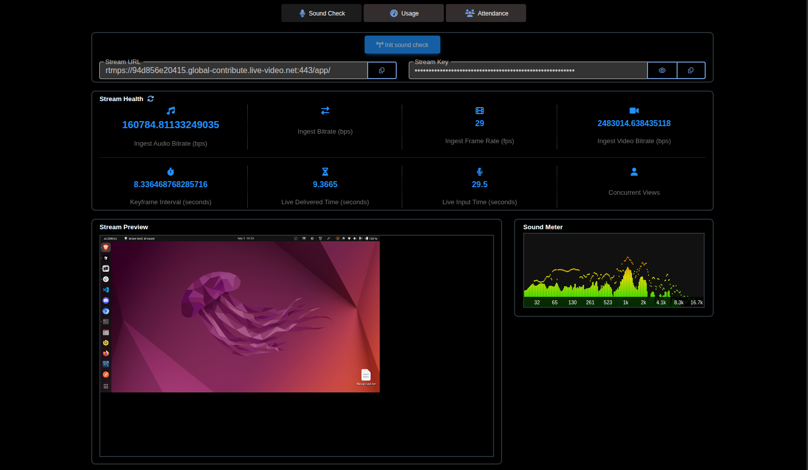

# Sound Check Component Documentation

This document provides user and technical documentation for the
`SoundCheckComponent`, which is responsible for allowing privileged users to
test a live stream feed before an event, monitor its health, and preview the
stream.

## 1. User Guide

The Sound Check feature provides a dedicated interface for event administrators
to verify that the stream source (like OBS or other broadcasting software) is
correctly configured and that the video/audio feed is being received and
processed properly by the system.

### 1.1. Prerequisites

- You must have the `CanManagePipelines` permission assigned to your user role.
  If you do not have this permission, you will see a message stating: "You don't
  have permission to test sound check."

### 1.2. Workflow

1.  **Navigate to the Component**: Access the Sound Check page within the Stream
    Details page.
2.  **Initialize Sound Check**:
    - Click the **"Init sound check"** button.
    - A confirmation dialog will appear. Confirming this action signals the
      backend to either find an available sound check pipeline or create a new,
      dedicated AWS IVS channel for your test. Once ready, it provides the
      secure stream credentials.
3.  **Configure Your Streaming Software**:
    - Once confirmed, the **Stream URL** and **Stream Key** will be displayed on
      the page.
    - Copy the `Stream URL` and `Stream Key` into your broadcasting software
      (e.g., OBS, vMix). The `Copy` button next to each field can be used for
      this.
    - The Stream Key is hidden by default for security. You can click the "eye"
      icon to reveal it.
4.  **Start Streaming**:
    - Begin streaming from your broadcasting software.
    - The backend will detect the incoming feed via AWS IVS events. The
      `Stream Preview` video player will automatically load and play the live
      stream.
5.  **Monitor the Stream**:
    - **Stream Preview**: Watch the video player to visually confirm the
      stream's quality and content. The player includes standard controls like
      play/pause and volume.
    - **Sound Meter**: Observe the audio motion meter to the right of the video.
      This provides a real-time visualization of the audio levels being
      received, helping to ensure the audio is not silent or clipping.
    - **Stream Health**: Review the health metrics below the stream credentials.
      These metrics, fetched from AWS CloudWatch, provide technical details
      about the stream's stability and quality. You can click the refresh icon
      to fetch the latest metrics at any time. The metrics also update
      automatically every 90 seconds.
6.  **End the Sound Check**:
    - Stop the stream from your broadcasting software.
    - When you navigate away from the Sound Check page, the component
      automatically sends a signal to the backend to release the sound check
      channel, making it available for future use, and cleans up all resources
      on the client-side.

### 1.3. UI Elements



- **Init sound check button**: Starts the process and generates stream
  credentials. Disabled after initialization.
- **Stream URL / Stream Key**: The RTMP ingest URL and secret key for your
  streaming software. These are read-only.
- **Copy Buttons**: Allows for quick copying of the URL and key. A "Copied!"
  message appears briefly on success.
- **Show/Hide Key Button**: Toggles the visibility of the stream key.
- **Stream Health Section**: A dashboard displaying key performance indicators
  of the stream.
  - **Ingest Audio/Video Bitrate (bps)**: The data rate of the audio/video feed
    being sent to the server.
  - **Ingest Bitrate (bps)**: The total data rate of the incoming stream.
  - **Ingest Frame Rate (fps)**: The number of frames per second being received.
  - **Keyframe Interval (seconds)**: The frequency of keyframes in the video
    stream.
  - **Live Delivered/Input Time (seconds)**: Metrics related to stream latency.
  - **Concurrent Views**: The number of users currently watching the stream
    preview.
- **Stream Preview**: An embedded video player (Amazon IVS Player) that displays
  the live feed.
- **Sound Meter**: A visual representation of the stream's audio levels.

## 2. Technical Specifications

This section covers the technical implementation of the Sound Check feature,
including the frontend component and the backend request handler.

### 2.1. Frontend

The `SoundCheckComponent` is the Angular component that orchestrates WebSocket
communication, video playback, and real-time metric display.

#### **Core Technologies**

- **Amazon IVS Player**: Used for low-latency playback of the HLS stream
  (`playbackUrl`). The component lazy-loads the necessary IVS player assets
  (`wasmWorker`, `wasmBinary`).
- **AudioMotionAnalyzer**: A JavaScript library used to create the audio
  visualizer (sound meter) from the video element's audio track.
- **WebSocket (via `SocketService`)**: Used for real-time, bidirectional
  communication with the backend server.

#### **Component Lifecycle**

- **`ngOnInit()`**:
  1.  Initializes the `SocketService` connection.
  2.  Subscribes to the `platformCommonService` to listen for the result of the
      confirmation dialog.
  3.  Subscribes to route data to retrieve `breakout` information.
  4.  Calls `listenToSocketEvents()` to set up handlers for incoming WebSocket
      messages.
- **`ngOnDestroy()`**:
  1.  Hides any active loaders.
  2.  Clears the health metric polling interval (`healthPollingInterval`).
  3.  Calls `destroyPlayer()` to terminate the IVS player instance.
  4.  Unsubscribes from the `confirmationListener`.
  5.  Calls `leaveSoundCheck()` to send the `leave-sound-check` WebSocket
      message to the backend.
  6.  Calls `disconnectAudioMeter()` to clean up the `AudioContext` and
      `AudioMotionAnalyzer` instances, preventing memory leaks.

### 2.2. Backend

The backend logic is handled by the `SoundCheckRequestHandler`, which manages
the lifecycle of sound check resources in response to WebSocket messages.

#### **Core Technologies**

- **Socket.IO**: For real-time WebSocket communication.
- **AWS SDK**: Used to interact with AWS services, primarily IVS (for channels)
  and CloudWatch (for metrics).

#### **Pipeline Management**

- **Persistence**: Sound check channels are stored in the database using
  `PipelineModel`. Each account has its own dedicated sound check channel to
  avoid conflicts.
- **Creation**: If a channel doesn't exist for an account when
  `init-sound-check` is received, a new AWS IVS channel is created with the name
  format `sound-check-<accountId>-<timestamp>`. This action is logged as a
  `PIPELINE_CREATED` audit event.
- **Lifecycle & Locking**: To prevent concurrent use, a channel is marked as
  "acquired" (`acquired: true`) when a user starts a sound check. It is
  "released" (`acquired: false`) when the user leaves the page. The underlying
  AWS IVS channel is **not** deleted, allowing for quick re-use in subsequent
  tests.

### 2.3. Frontend/Backend Communication (WebSocket)

Communication occurs over the `sound-check` event channel. The backend uses a
room (`sound-check-<pipelineId>`) to broadcast messages to the specific client
instance that initiated the check.

#### **Outgoing Messages (Client to Server)**

- `init-sound-check`: Sent when the user confirms the initialization dialog. The
  backend finds or creates a pipeline, marks it as `acquired`, and joins the
  client's socket to the pipeline's room.
  ```json
  { "request": "init-sound-check" }
  ```
- `get-sound-check-pipeline-health`: Sent to request updated stream metrics,
  either manually or by the 90-second poller. The backend fetches the latest
  data from AWS CloudWatch.
  ```json
  { "request": "get-sound-check-pipeline-health" }
  ```
- `leave-sound-check`: Sent during `ngOnDestroy` to notify the backend that the
  user has left the page. The backend releases the pipeline (`acquired: false`)
  and the socket leaves the room.
  ```json
  { "request": "leave-sound-check" }
  ```

#### **Incoming Messages (Server to Client)**

- `messageType: 'stream-info'`: Received after a successful `init-sound-check`.
  Contains the credentials to configure the encoder and the player.
  ```typescript
  // data payload
  {
    ingestUrl: string;
    secretKey: string;
    playbackUrl: string;
    isLive: boolean;
  }
  ```
- `messageType: 'ivs-stream-state-change'`: Provides real-time updates on the
  stream's status from AWS IVS. The component uses this to start/stop the player
  and health polling.
  - `eventName: 'Stream Start'`: Sets `streamInfo.isLive` to `true` and calls
    `startVideoStream()`.
  - `eventName: 'Stream End'`: Sets `streamInfo.isLive` to `false`, destroys the
    player, and clears the health polling interval.
- `messageType: 'pipeline-health-metrics'`: Contains the data for the "Stream
  Health" section, fetched from CloudWatch. The `healthMetrics` property is
  updated with the message data.

> Note: If the pipeline is already streaming, `isLive` is recieved as `true` and
> the player is started. If the pipeline is not streaming, `isLive` is recieved
> as `false`

### 2.4. Third-Party Integrations

#### **Amazon IVS Player**

- **Initialization**: The player is created in `playVideoStream()` only if
  `isPlayerSupported` is true. It attaches to the `<video id="video">` element.
- **Error Handling**: The component listens for `PlayerEventType.ERROR`. If a
  `NOT_AVAILABLE` error occurs (meaning the HLS manifest isn't ready), it
  retries starting the stream after a 2-second delay.
- **Destruction**: The `destroyPlayer()` method calls `player.delete()` to
  properly release the player's resources.

#### **AudioMotionAnalyzer**

- **Initialization**: `initAudioMeter()` is called after the IVS player is
  loaded. It creates a new `AudioContext` and a `MediaElementAudioSourceNode`
  from the video element. This source node is then fed into the
  `AudioMotionAnalyzer`.
- **Destruction**: `disconnectAudioMeter()` ensures the analyzer, source node,
  and audio context are all destroyed and disconnected to prevent audio
  processing from continuing in the background. This is a critical cleanup step.