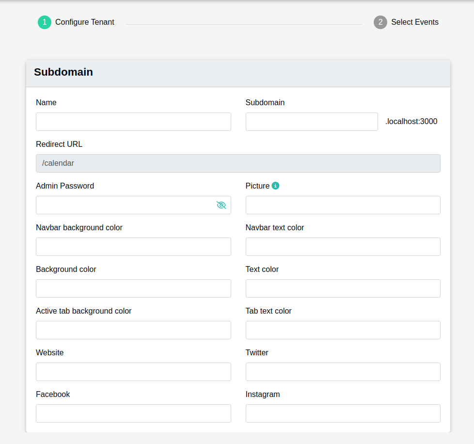
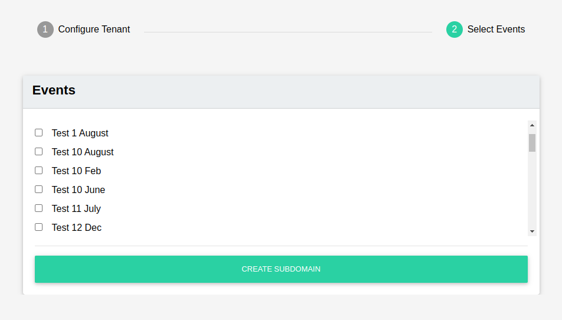
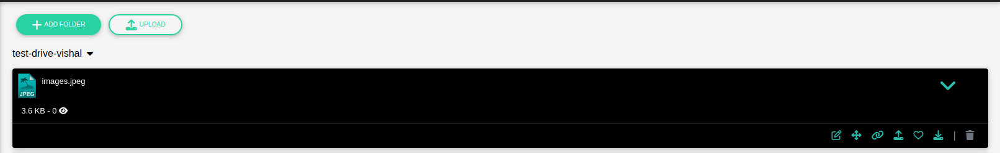
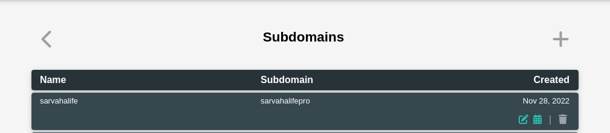
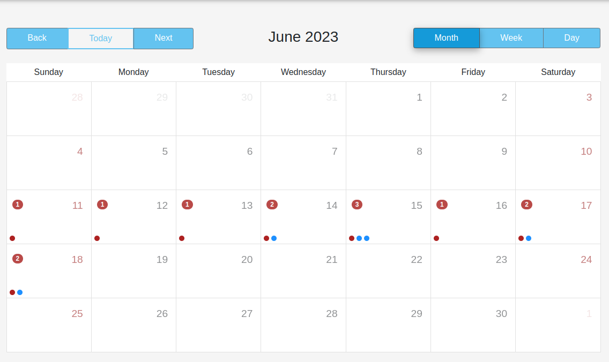

### Step 1: Create a tenant

- Configure Tenant: 
    - Tenant Name: Tenant name
    - Subdomain Name: Subdomain to be used for this tenant. A Route 53 record will be added.
    - Redirect URL: On tenant user login success will be redirected to '/calendar' path
    - Admin Password: Tenant admin user password.
    - Picture: Tenant navbar logo. A logo file needs to be uploaded to `tenants` folder of the s3 bucket `pro-stream-pictures`.
    - Navbar background color: Color value. For example, use #ffffff hex value for white navbar background color.
    - Navbar text color: Color value. For example, use #000000 hex value for black navbar text color.
    - Background color: Color value. For example, use #ffffff hex value for white background color.
    - Text color: Color value. For example, use #000000 hex value for black text color.
    - Active tab background color: Color value. For example, use #ffffff hex value for white active tab background color. It represents all embossed elements' background color. For example, selected calendar tab.
    - Tab text color: Color value. For example, use #000000 hex value for black tab text color.
    - Website: Tenant website url. Please start url with http:// or https://.
    - Twitter: Tenant Twitter url. Please start url with http:// or https://.
    - Facebook: Tenant Facebook url. Please start url with http:// or https://.
    - Instagram: Tenant Instagram url. Please start url with http:// or https://.

- Select Events:
  - Select events from available events list.

### Step 2: Upload a tenant logo to s3 bucket

A logo file needs to be uploaded from MediaManager drive. Copy link of uploaded image by clicking link button.

### Step 3: Navigate to tenant events schedule

From the admin, go to tenants list. Click on the calendar icon.

It'll open tenant related events  calendar url in the new tab.

