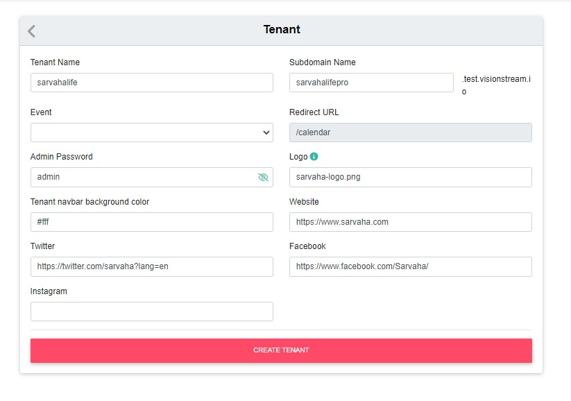
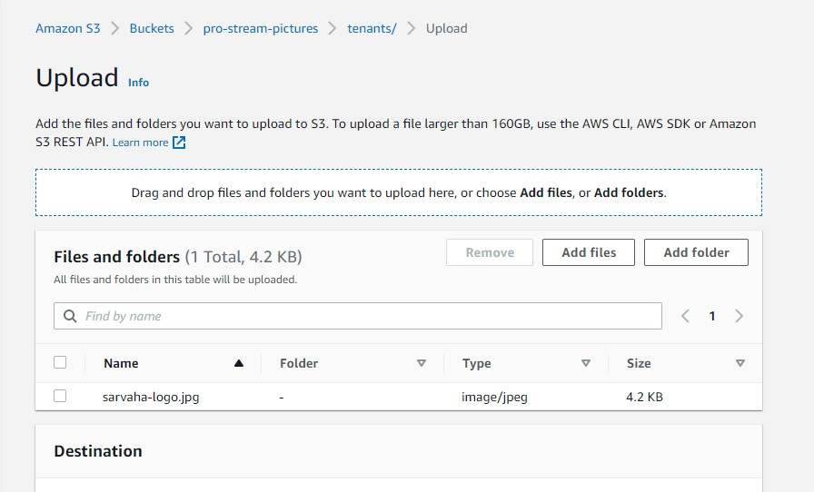
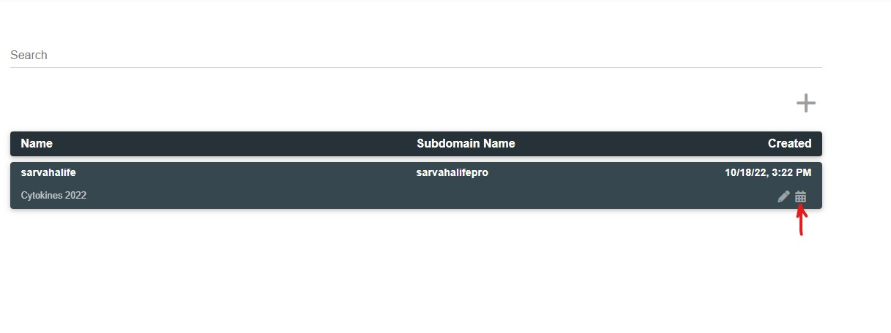
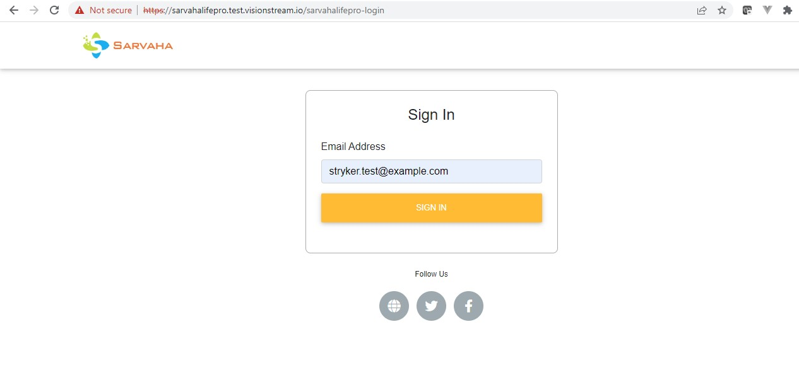

### Step 1: Create a tenant
- Tenant Name: Tenant name
- Subdomain Name: Subdomain to be used for this tenant. A Route 53 record will be added.
- Event: Associate an event with tenant.
- Redirect URL: On tenat user login success will be redirected to '/calendar' path
- Admin Password: Tenant admin user password.
- Logo: Tenant navbar logo. A logo file needs to be uploaded to `tenants` folder of the s3 bucket `pro-stream-pictures`.
- Tenant navbar background color: Color value. For example, use #ffffff hex value for white navbar background color.
- Website: Tenant website url. Please start url with http:// or https://.
- Twitter: Tenant Twitter url. Please start url with http:// or https://.
- Facebook: Tenant Facebook url. Please start url with http:// or https://.
- Instagram: Tenant Instagram url. Please start url with http:// or https://.

### Step 2: Upload a tenant logo to s3 bucket

A logo file needs to be uploaded to `tenants` folder of the s3 bucket `pro-stream-pictures`

### Step 2: Navigate to tenant schedule

From the admin, go to tenants list. Click on the calendar icon.

It'll open tenant url in the new tab. As it requires tenant user login. Login using any previous tenant user added.

stryker.test@example.com

TODO: In the future, this will not work unless we import tenant users. New auth implementation based on orgs coming in to the picture.

