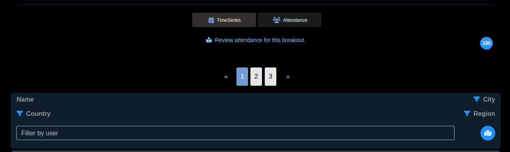
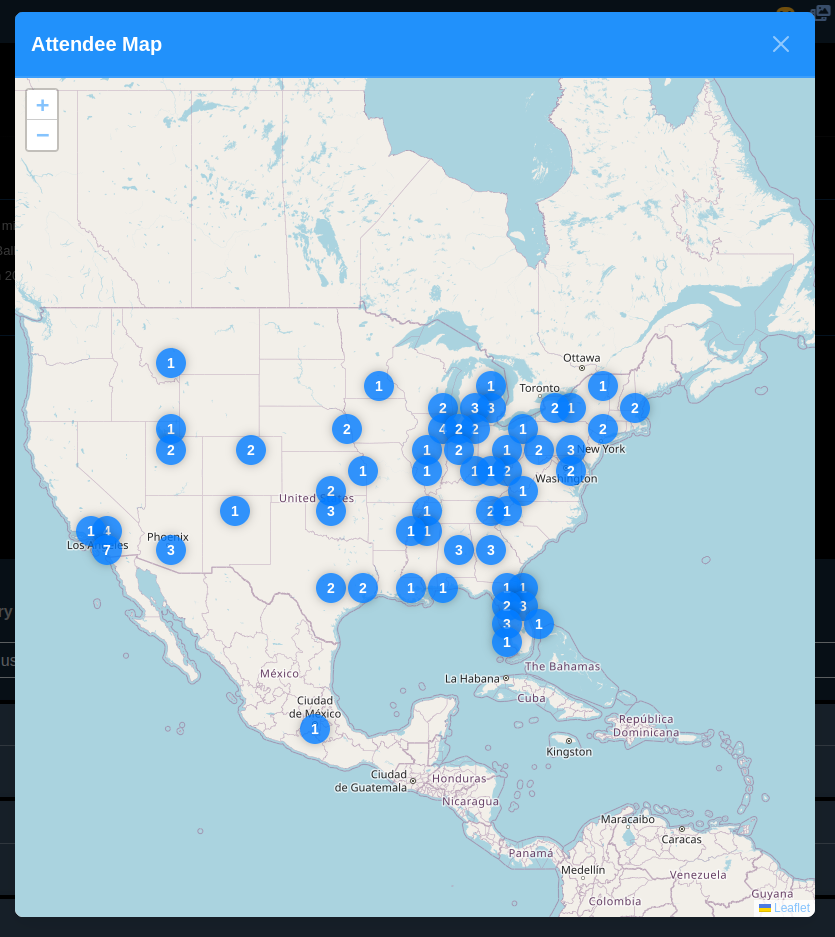

#  Attendance

VisionStream will report user attendance, including time engaging in your content, including both livestreams and on-demand recordings.

##  Overview

The attendance viewer page provides a tabular representation of attendees, allowing users to analyze participation data efficiently. Each row in the table displays attendee details, including their name, city, state, and country. Users can apply filters based on city, region, or country to refine the displayed results.

At the top of the table, the total number of attendees matching the selected filters is shown. Users can navigate through the records page by page, with page numbers displayed at both the top and bottom of the table.

## Filtering Options

Users can filter attendees based on:

- City
- Region (State/Province)
- Country
- Filter by user

Applying a filter updates the table to display only the relevant attendees.

## Pagination

The attendance table supports page-wise navigation, allowing users to browse large datasets efficiently. The current page and navigation options are available at both the top and bottom of the table.

## Map Visualization
A map icon is available for users who prefer a visual representation of attendees. Clicking the icon opens an interactive world map, where attendees are organized into geo clusters.

### Features of the Map View

- **Zoom In and Zoom Out:** Allows users to adjust the view for a broader or more detailed perspective.
- **Geo Clusters:** Attendees are grouped into clusters based on geographic proximity.
- **Cluster Click:** Clicking on a cluster reveals detailed attendance information in the table.

This map-based visualization enhances understanding of attendee distribution across different regions.

## Use Cases

### Tracking Event Participation:

- View the list of attendees for a specific event.
- Filter by city, region, or country to analyze participation trends.
- Geographical Analysis of Attendees

### Identify where most attendees are coming from using the map visualization.
- Use geo clusters to observe attendee distribution across regions.
- Identifying Regional Engagement Trends

### Compare attendance numbers from different locations to spot high-engagement areas.
- Use filtering options to refine the analysis by city, state, or country.

### Identify areas with high engagement for targeted marketing.
- Plan future events based on attendance distribution.
