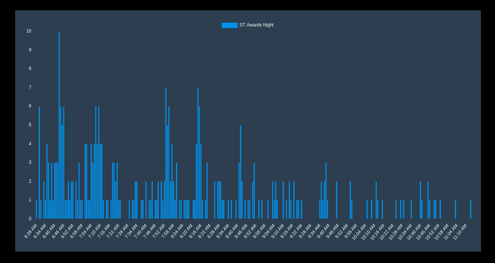

#  Attendance

VisionStream will report user attendance, including time engaging in your content, including both livestreams and on-demand recordings.

##  Overview

The Attendance Timeseries View provides a detailed breakdown of when attendees joined a breakout session over time. This visualization helps analyze audience engagement patterns, identify peak participation times, and understand how attendance fluctuates throughout the session.

<small>The graph depicts how attendees joined the live show over time. The x-axis represents the timeseries, showing the progression of time, while the y-axis indicates the number of attendees who joined during each time interval. This visualization helps analyze audience growth patterns, highlighting surges in participation and trends in viewer engagement throughout the event.</small>

## Chart Details

- **Chart Type:** Bar Chart
- **X-Axis (Time Intervals):** Represents time in 2-minute intervals, showing attendance trends in short time segments.
- **Y-Axis (Attendee Count):** Displays the number of attendees who joined within each 2-minute interval throughout the session.

## Explanation of Data

- Each bar represents the count of unique attendees who joined the breakout session during a specific 2-minute interval.
- This visualization helps track real-time attendance trends, showing when most users joined and how engagement evolved throughout the session.
- By identifying spikes or drop-offs, event organizers can assess the impact of session start times, engagement strategies, and potential technical issues affecting attendance.

## Use Cases
- **Understanding Join Behavior:** Identify peak join times and when attendees are most likely to enter a session.
- **Technical Performance Analysis:** Detect potential connectivity issues or delays based on sharp drops or inconsistencies in attendance.
- **Session Optimization:** Use insights to adjust event timing, optimize engagement strategies, or improve scheduling for future sessions.
- **Engagement Trend Analysis:** Compare attendance trends across multiple breakouts to evaluate session popularity and participation patterns.
