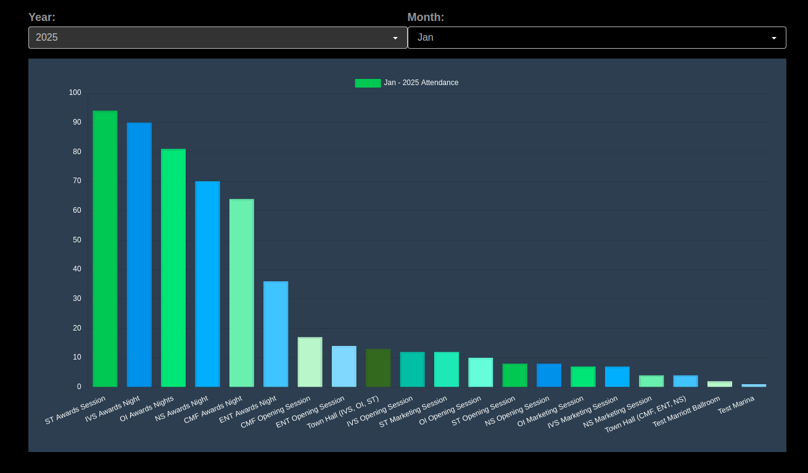

#  Attendance

View attendance trends across years, months and over all breakouts.

##  Overview

* This feature provides attendance tracking for streaming sessions.
* It presents attendance data in the form of a bar graph, showcasing the attendance count for each month of the year allowing users to visualize yearly attendance trends and patterns.
* When a user hovers over a single vertical bar, the attendance count for a month is shown.
* When a specific month is clicked, it further displays attendance details for each breakout that occurred within that month.
  - A breakout refers to a streaming session with a duration ranging from 15 minutes to 4 hours.

## Annual Attendance Trends: Monthly Overview

The Monthly Attendance Chart provides a visual representation of attendance trends over a selected year. It helps track attendance patterns, compare monthly counts, and analyze participation trends over time.

<small>The graph illustrates how unique attendees joined the live show over time. The x-axis represents the months, showing the timeline of attendance, while the y-axis indicates the count of unique attendees each month. Note that the same attendee may appear in multiple months, as this visualization captures monthly unique participation rather than a cumulative or yearly total. This helps analyze recurring audience engagement and trends over time.</small>

### Filters and Metrics

**Year Filter**

At the top of the chart, there is a Year Filter that allows users to select a specific year. The chart updates dynamically based on the selected year, displaying attendance data for that period.

### Key Metrics Displayed in the Header

**Distinct Attendees (Yearly)**

- Represents the number of unique individuals who attended at least once during the selected year.
- Helps understand the reach and engagement of attendees over the year.

**Total Attendees (All-Time)**

- Shows the cumulative count of all attendees across all recorded years.
- Provides insights into long-term attendance trends and overall participation growth.

**Chart Details**

- **X-Axis (Months):** Displays each month from January to December.
- **Y-Axis (Attendance Count):** Represents the total number of attendees for each month in the selected year.
- **Data Representation:** The chart visually illustrates attendance fluctuations throughout the year, helping identify seasonal trends or irregularities in participation.

**Use Cases**

- **Tracking Attendance Growth:** Compare attendance across different years using the year filter.
- **Identifying Seasonal Trends:** Recognize high and low attendance periods.
- **Evaluating Engagement:** Assess whether attendance is improving year-over-year.
- **Decision-Making:** Use insights to plan for future events or resource allocation.

**Additional Notes**

- The Total Attendees count remains unchanged when switching years since it reflects the overall attendance across all time.
- Data updates dynamically when a different year is selected in the filter.

## Choosing Ranges

* Users can select the desired year using a dropdown menu.
* Upon selecting the year, the app retrieves attendance data for that particular year.
* When clicking on any vertical bar, the user can even apply filtering month wise to view attendance for each breakout that occurred within that month.

## Detailed Monthly Attendance View

When you click on one of the month bars in the main chart, you are redirected to a new page that provides a more granular view of attendance for the selected month. This page offers detailed insights into attendee behavior, broken down by Breakout Names and their corresponding attendance counts.

<small>The graph illustrates unique attendee participation across different breakout sessions. The x-axis represents the breakout session names, while the y-axis indicates the count of unique attendees in each session. Note that the same attendee may join multiple sessions, so this visualization reflects unique participation per session rather than a total event-wide count. This helps analyze attendee interest and engagement across sessions.</small>

### Filters and Metrics

**Year and Month Dropdown Filters**

At the top of the page, you will find two dropdown filters:

1. **Year Filter** – Allows you to select the year for which you want to view attendance data.
2. **Month Filter** – Allows you to select a specific month within the chosen year for a more focused view.

Both filters allow users to fine-tune their data exploration, providing the flexibility to analyze attendance trends across different timeframes.

**Attendance Metrics**

**Breakout Names (X-Axis):**

  - Displays the names of various breakouts or sessions within the selected month. Breakouts could refer to different shows within the overall event.
  - This allows you to see which breakouts had higher or lower engagement, helping identify areas of interest or focus.

**Attendance Count (Y-Axis):**

  - Represents the total count of unique attendees for each breakout. The y-axis indicates how many unique individuals joined a particular session or breakout within the selected month.
  - The count reflects the total number of distinct participants for each breakout, not including repeat participation from the same individual within that month.

### Explanation of Data

**Graph Interpretation:**

The graph illustrates how unique attendees joined the live show over time, broken down by the specific breakout or session. This allows you to see patterns in engagement within different parts of the event or show.

**Note on Recurring Participation:**

- It's important to note that the same attendee may appear across multiple breakouts or months. This graph tracks monthly unique participation, meaning an individual may attend several different sessions or shows during the same month, but only counted once for each session they attended.
- This helps in analyzing recurring audience engagement and spotting trends, as you can determine which sessions attract repeat attendance or which new breakouts drive new participants.

### Use Cases for the Detailed View

- **Identifying Popular Breakouts:** Quickly pinpoint which sessions or breakouts had the highest engagement.
- **Understanding Recurring Attendees:** Assess how many attendees returned for multiple breakouts or sessions, highlighting overall audience loyalty and recurring participation.
- **Event Planning:** Use insights to optimize scheduling or resource allocation by focusing on the most popular breakouts.
- **Engagement Trends:** Identify which breakouts are gaining or losing interest month-to-month, allowing for more informed decisions in future events.

## Attendance Timeseries

Clicking on a **Breakout** bar in the **Monthly Attendance** chart takes you to a detailed **Attendance Timeseries View**, showing how attendees joined the breakout session over time. This chart helps analyze join patterns, peak participation times, and overall engagement trends within the selected breakout. The **x-axis represents time**, while the **y-axis shows the number of attendees**, allowing for a clear visualization of audience behavior throughout the session.
