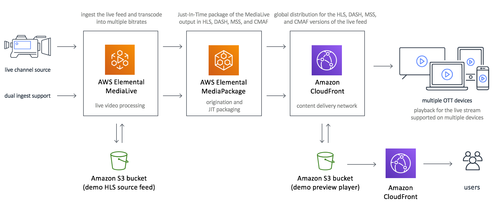
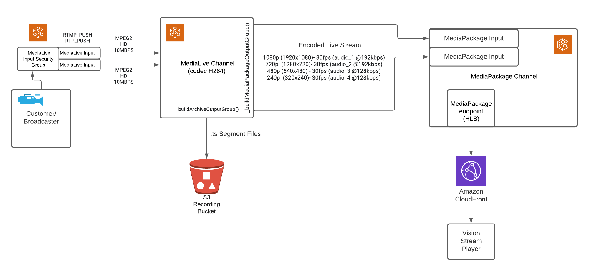
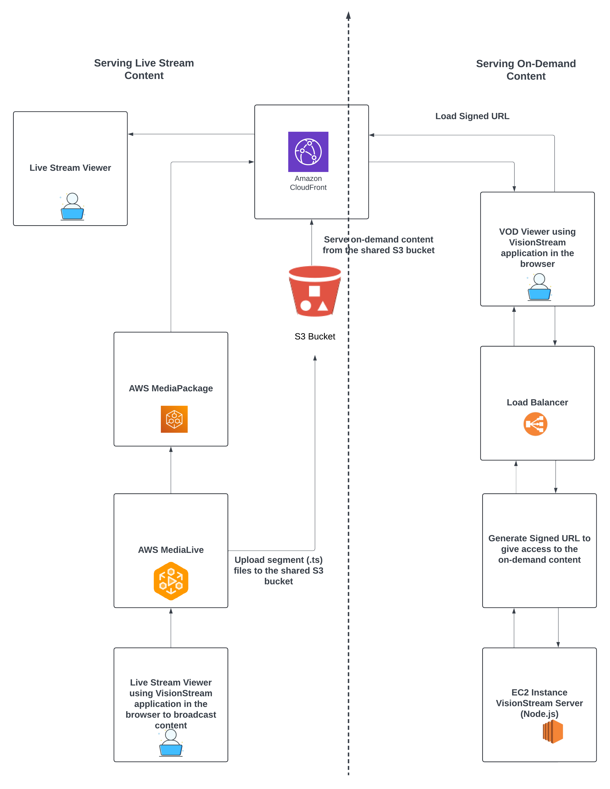

# Network Topology

## Standard Network Topology

### Architecture Overview

1. **Live Channel Source**
    - A live video feed is ingested from a camera or a broadcasting source.
    - Dual ingest support is provided for high availability and fault tolerance.

2. **AWS Elemental MediaLive**
    - MediaLive handles **live video processing**.
    - It transcodes the video feed into multiple bitrates to enable adaptive bitrate streaming.
    - The processed streams are then sent to the next component.

3. **AWS Elemental MediaPackage**
    - MediaPackage provides **Just-in-Time (JIT) packaging**, converting the transcoded streams into formats such as **HLS**, **DASH**, **MSS**, and **CMAF** for compatibility with various devices.
    - MediaPackage ensures low-latency streaming and also supports encryption for secure content delivery.

4. **Amazon CloudFront**
    - CloudFront acts as a **Content Delivery Network (CDN)** for global distribution of the packaged streams.
    - It caches content at edge locations to reduce latency and enhance the streaming experience for viewers worldwide.

5. **Amazon S3**
    - Shared Amazon S3 bucket is used to store segment files (.ts) generated from AWS MediaLive and recordings (VOD content) content.

6. **Multiple OTT Devices**
    - The packaged and distributed streams are compatible with a range of OTT (Over-The-Top) devices, including smart TVs, tablets, smartphones, and desktop players.
    - Users enjoy smooth playback across devices thanks to adaptive bitrate streaming.

---

## VisionStream Network Configuration Topology

### Architecture Overview

1. **Customer/Broadcaster**
    - The broadcaster or customer provides the live video feed.
    - The video stream is ingested into AWS Elemental MediaLive using **RTMP_PUSH** or **RTP_PUSH** protocols.

2. **AWS Elemental MediaLive**
    - **MediaLive Input Security Group**:
        - Controls access to MediaLive by allowing only authorized traffic.
        - Specific IP addresses are **whitelisted** in the Input Security Group, ensuring that only trusted sources can push the live stream. This prevents unauthorized or malicious access.
        - The broadcaster's IP address or the IP of their RTMP/RTP server must be explicitly added to the security group.
    - **MediaLive Input**:
        - Ingests and processes the video feed with an input bitrate of MPEG2 HD at 10Mbps.
    - **MediaLive Channel**:
        - Encodes the video feed using the **H.264 codec** into multiple output resolutions and bitrates:
            - 1080p (1920x1080) at 30fps (audio_1 @ 192kbps)
            - 720p (1280x720) at 30fps (audio_2 @ 192kbps)
            - 480p (640x480) at 30fps (audio_3 @ 128kbps)
            - 240p (320x240) at 30fps (audio_4 @ 128kbps)
        - Generates **.ts segment files** for video storage and delivery.

3. **Amazon S3 Recording Bucket**
    - Stores the **.ts segment files** for generating MP4 recordings.
    - Stores the MP4 recordings generated using AWS MediaConvert or MediaConvert.io service.

4. **AWS Elemental MediaPackage**
    - **MediaPackage Input**:
        - Receives the encoded live stream from MediaLive.
    - **MediaPackage Channel**:
        - Packages the live stream into the HLS format (HTTP Live Streaming).
    - **MediaPackage Endpoint**:
        - Provides an HLS endpoint for distribution to downstream services.

5. **Amazon CloudFront**
    - A **Content Delivery Network (CDN)** for global distribution of the live stream.
    - Reduces latency by caching content at edge locations, ensuring seamless playback for end users.

6. **Vision Stream Player**
    - A front-end player application used by end users to access and watch the live video stream delivered by CloudFront.

---

### Workflow Steps

1. The **live video feed** from the broadcaster is ingested into MediaLive via RTMP_PUSH or RTP_PUSH protocols.
2. MediaLive encodes the feed into multiple resolutions and bitrates.
3. Encoded streams are sent to MediaPackage, where they are packaged into HLS format.
4. Simultaneously, **.ts segment files** are stored in an S3 bucket for recording and archival purposes.
5. The packaged HLS stream is distributed via Amazon CloudFront for global delivery.
6. End users access the live stream using the Vision Stream Player.
7. Once streaming is over, MP4 recording is generated using AWS MediaConvert or MediaConvert.io service and stored in the same S3 bucket where segment files are stored.

### NOTE:

**Whenever any new account is created in the VisionStream app, it is assigned a separate CloudFront distribution and S3 bucket.**

**All the recordings, segment (.ts) files, and MediaManager content related to that account is stored in the S3 bucket assigned to it.**

**Similarly all the VOD recordings and MediaManager content related to that account is delivered using the CloudFront distribution assigned to that account.**

---

## Application Block Diagram

### Live Streaming Workflow:

1. **Broadcast Live Content**
    - The broadcaster uses the **VisionStream application** in their browser to stream live content.

2. **Ingest and Transcode Live Content**
    - The live stream is processed by **AWS MediaLive**, which transcodes the video into `.ts` segment files.
    - These `.ts` segment files are uploaded to a **shared S3 bucket**.

3. **Package Live Content**
    - **AWS MediaPackage** packages the `.ts` segment files and prepares the content for live streaming.

4. **Distribute Live Content**
    - The packaged live stream is distributed via **Amazon CloudFront** to ensure low-latency global delivery.

5. **Consume Live Content**
    - Live stream viewers access the content through the **VisionStream application**, which fetches the stream via CloudFront.

### VOD Workflow:

1. **Process On-Demand Content**
    - MP4 recordings are stored in the **same shared S3 bucket** used for `.ts` files. These recordings are available for on-demand streaming.

2. **Generate Secure Access**
    - When a VOD viewer requests content, the **VisionStream server** (hosted on an **EC2 instance**) generates a **signed URL** to grant secure, time-limited access.

3. **Distribute On-Demand Content**
    - The signed URL allows the viewer to access the MP4 recording via **Amazon CloudFront**.

4. **Consume On-Demand Content**
    - Viewers use the **VisionStream application** to stream the requested on-demand content.

### **Key Features**

#### Shared S3 Bucket
- A single S3 bucket is used to store both:
    - **Live Streaming Segment Files** (`.ts`)
    - **On-Demand MP4 Recordings**
