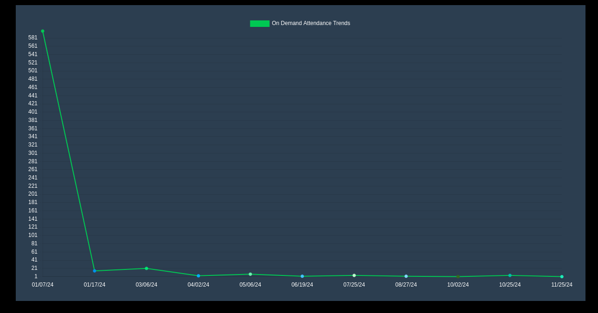

#  Video On Demand (VoD)

VisionStream supports **Video On Demand (VOD)** alongside **Live Breakout Sessions**, allowing attendees to engage with content at their convenience. Users can watch pre-recorded sessions, rewind, or pause content as needed, enhancing accessibility and engagement.

##  Overview

The Video on Demand (VOD) profiles page displays a list of breakout sessions along with their respective view counts. Below this list, a line chart visualizes the number of views over time.

The x-axis represents the selected time duration, reflecting the chosen interval from the filter. The y-axis indicates the number of views recorded within each time segment. This visualization helps analyze viewing patterns and audience engagement trends.

A filter located in the header allows users to adjust the time interval for the displayed data. The dropdown supports the following options:

- Today
- Yesterday
- Last 2 Days
- Last 7 Days
- Last 14 Days
- This Year
- Last Year

Selecting a different interval updates both the breakout session list and the graph, ensuring relevant insights based on the chosen timeframe.

## Explanation of Data
The data presented on this page represents video view counts based on unique plays within the selected time interval. A single user watching a breakout session multiple times within the same interval is counted as multiple views. However, the system does not track cumulative views across different intervals in this visualization.

The chart provides an overview of engagement trends, helping to identify spikes in viewership, consistent audience retention, or periods of low activity.

## Use Cases of This Page

- **Tracking Viewer Engagement:** Understand which breakout sessions are attracting the most views over different time periods.
- **Identifying Trends:** Detect viewership patterns, such as peak engagement days or recurring audience interest.
- **Performance Analysis:** Compare viewership across different time intervals to evaluate session popularity over time.
- **Filtering for Insights:** Use the time filter to analyze short-term spikes (e.g., daily views) or long-term trends (e.g., yearly performance).
- **Content Strategy Planning:** Leverage historical viewership data to guide future content creation and scheduling decisions.
